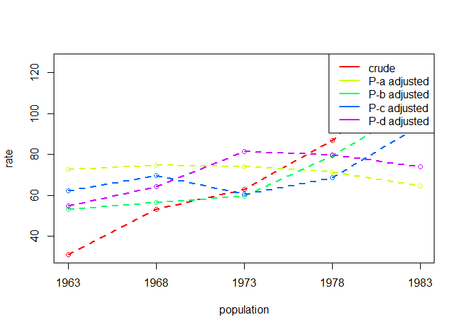
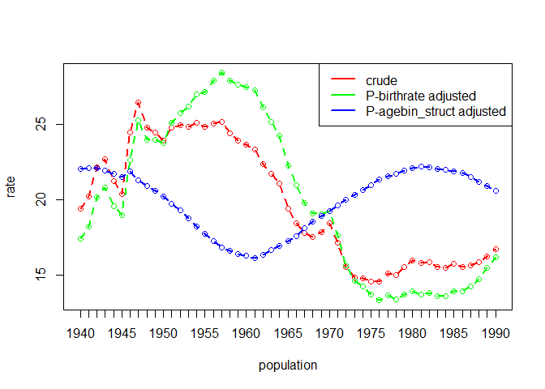
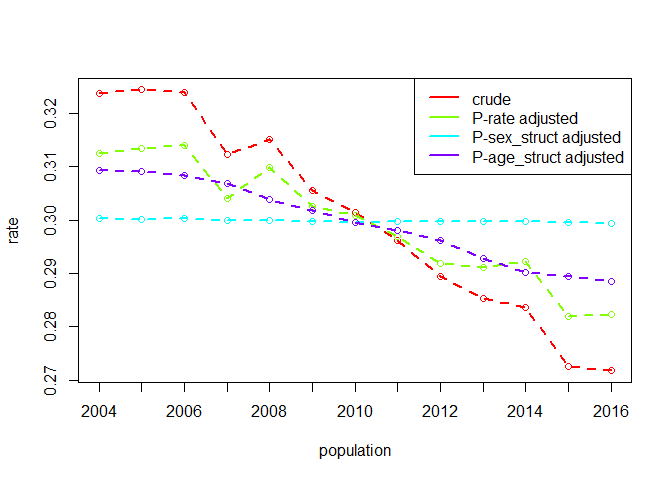

<!-- README.md is generated from README.Rmd. Please edit that file -->

# DasGuptR

The goal of the DasGuptR package is to provide an implementation of
Prithwith Das Gupta’s specification of *standardization* and
*decomposition* of rates[^1].

## Installation

You can install DasGuptR from here with:

``` r
# install.packages("devtools")
devtools::install_github("josiahpjking/DasGuptR")
```

# Background and worked examples

Standardization and decomposition are widely used analytic techniques to
adjust for the impact of compositional factors on rates.

- *Standardization*: Shows us what a rate would have been under
  different scenarios - for example, if there was no difference in the
  age-structure of the population, or if there was no change in the
  age-specific rates of the event we are studying.

- *Decomposition*: Gives us the percentage of the difference in rates
  between two years attributable to each of the factors we have included
  in the standardization.

In the simplest example, consider a case where the rate is taken as the
product of two factors $\alpha$ and $\beta$ — $R = \alpha\beta$.
Throughout Das Gupta’s work, greek letters are used to indicate the
different compositional factors, and upper and lower case latin letters
are used to denote specific population values of these:

|            | pop1 | pop2 |
|------------|------|------|
| $\alpha$   | $A$  | $a$  |
| $\beta$    | $B$  | $b$  |
| crude rate | $AB$ | $ab$ |

In this simple case, we can standardise across the two populations,
calculating $\alpha$-adjusted rates by replacing $A$ and $a$ with
$\frac{a+A}{2}$.

|                                     | pop1             | pop2             |
|-------------------------------------|------------------|------------------|
| $\alpha$                            | $A$              | $a$              |
| $\beta$                             | $B$              | $b$              |
| crude rate <br> $R_{crude}$         | $AB$             | $ab$             |
| $\beta$-adjusted <br> $R_{-alpha}$  | $A\frac{B+b}{2}$ | $a\frac{B+b}{2}$ |
| $\alpha$-adjusted <br> $R_{-\beta}$ | $\frac{A+a}{2}B$ | $\frac{A+a}{2}b$ |

These $\alpha$-adjusted rate can be interpreted as “what the crude rate
would look like if $\alpha$ was held equal” (and analogously for
$\beta$). In cases involving multiple factors, this can quickly become
unwieldy, as the standardisation process takes each factor in turn and
produces an adjusted rate where “all other factors are held equal”. For
instance, in the case of a rate as the product of four factors
$R = \alpha\beta\gamma\delta$, we get out four sets of adjusted rates:
the $\alpha\beta\gamma$-adjusted, $\beta\gamma\delta$-adjusted,
$\alpha\gamma\delta$-adjusted, and $\alpha\beta\delta$-adjusted.

For this reason, we opt to refer to these rates as, e.g., $P-\alpha$,
where $P$ is the set of all compositional factors. This is reflected in
the table above, where we have used $R_{crude}$, $R_{-\alpha}$ and
$R_{-\beta}$ to denote the crude, the $P-\alpha$-adjusted (or
$\beta$-adjusted), and the $P-\beta$-adjusted (or $\alpha$-adjusted)
rates. The $P-\alpha$-adjusted rate can therefore be interpreted as
“what the crude rate would look like if $\alpha$ changed but all other
factors were held equal”.

The *difference* in the adjusted (or ‘standardised’) rates is known as a
**decomposition effect**, named due to the fact that differences in the
crude rates can be decomposed into differences in adjusted rates:

$$
\Delta R_{crude} = \Delta R_{-\alpha} + \Delta R_{-\beta}
$$ This decomposition allows us to quantify how much of the difference
between two crude rates is due to differences in $\alpha$, differences
in $\beta$, and so on. [^2]

## DasGuptR functionality

Consider an example of the simple case described above (2 factors, 2
populations).

DasGuptR requires data to be in long format, with columns for each
factor, and a single variable denoting the population:

``` r
eg.dg <- data.frame(
  pop = c("pop1","pop2"),
  alpha = c(.6,.3),
  beta = c(.5,.45)
)
eg.dg
#>    pop alpha beta
#> 1 pop1   0.6 0.50
#> 2 pop2   0.3 0.45
```

In this case, the calculations for the adjusted rates can easily be
calculated manually:

``` r
data.frame(
  pop = c("pop1","pop2"),
  Rcrude = c(.6*.5, .3*.55),
  R_alpha = c(.6,.3) * ((.5+.45)/2),
  R_beta = ((.6+.3)/2) * c(.5,.45)
) |> t()
#>         [,1]     [,2]    
#> pop     "pop1"   "pop2"  
#> Rcrude  "0.300"  "0.165" 
#> R_alpha "0.2850" "0.1425"
#> R_beta  "0.2250" "0.2025"
```

The workhorse of the DasGuptR package is `dgnpop()` which computes the
adjusted rates for P factors across N populations:

``` r
library(DasGuptR)
dgnpop(eg.dg, pop = "pop", factors=c("alpha","beta"))
#>     rate  pop std.set factor
#> 1 0.3000 pop1    <NA>  crude
#> 2 0.1350 pop2    <NA>  crude
#> 3 0.2850 pop1    pop2  alpha
#> 4 0.1425 pop2    pop1  alpha
#> 5 0.2250 pop1    pop2   beta
#> 6 0.2025 pop2    pop1   beta
```

These can be quickly turned into a wide table in the style of Das Gupta
using `dg_table()`. This also provides the difference in rates

``` r
dgnpop(eg.dg, pop = "pop", factors=c("alpha","beta")) |>
  dg_table()
#>        pop1   pop2    diff decomp
#> alpha 0.285 0.1425 -0.1425  86.36
#> beta  0.225 0.2025 -0.0225  13.64
#> crude 0.300 0.1350 -0.1650 100.00
```

Or plotted (this is far more useful for time series data)

``` r
dgnpop(eg.dg, pop = "pop", factors=c("alpha","beta")) |>
  dg_plot()
```


## Rates as functions, N populations, vector factors and cross-classified data

Rates may be composed of many factors, and they may not be calculated as
a simple product. Additionally, we may desire to standardise across many
populations — such as in a time series — or we may have be interested in
how the compositional structure of populations contributes to the
differences in these rates. TODO add in expl of cross classified

The full explanation of Das Gupta’s methodology for standardisation and
decomposition are explained in full in his 1993 book *[Standardization
and decomposition of rates: A user’s
manual](https://babel.hathitrust.org/cgi/pt?id=osu.32437011198450)*

Below are various examples taken from Das Gupta’s 1993 work

### P factors

The addition of factors into the make up of a population rate is handled
in `dgnpop()` by simply adding the variable name into the `factors`
argument.  
The default behaviour will be to take the rate to be the product of all
factors specified.

#### 2 factors, 2 populations, R=ab

``` r
eg2.1 <- data.frame(
  pop = c("black","white"),
  avg_earnings = c(10930, 16591),
  earner_prop = c(.717892, .825974)
)

dgnpop(eg2.1, pop="pop", factors=c("avg_earnings", "earner_prop")) |>
  dg_table()
#>                 black    white     diff decomp
#> avg_earnings 8437.228 12807.14 4369.913  74.61
#> earner_prop  9878.553 11365.82 1487.262  25.39
#> crude        7846.560 13703.73 5857.175 100.00
```

#### 3 factors, 2 populations, R=abc

``` r
eg2.3 <- data.frame(
  pop = c("austria","chile"),
  birthsw1549 = c(51.78746, 84.90502),
  propw1549 = c(.45919, .75756),
  propw = c(.52638, .51065)
)

dgnpop(eg2.3, pop="pop", factors=c("birthsw1549", "propw1549", "propw")) |>
  dg_table()
#>              austria    chile       diff decomp
#> birthsw1549 16.31618 26.75021 10.4340333  51.33
#> propw1549   16.25309 26.81394 10.5608476  51.95
#> propw       22.32040 21.65339 -0.6670084  -3.28
#> crude       12.51747 32.84534 20.3278726 100.00
```

#### 4 factors, 2 populations, R=abcd

``` r
eg2.5 <- data.frame(
  pop = c(1971, 1979),
  birth_preg = c(25.3, 32.7),
  preg_actw = c(.214, .290),
  actw_prop = c(.279, .473),
  w_prop = c(.949, .986)
)

dgnpop(eg2.5, pop="pop", c("birth_preg", "preg_actw", "actw_prop", "w_prop")) |>
  dg_table()
#>                1971     1979      diff decomp
#> birth_preg 2.355434 3.044375 0.6889411  23.05
#> preg_actw  2.287936 3.100474 0.8125381  27.18
#> actw_prop  1.988818 3.371723 1.3829055  46.26
#> w_prop     2.686817 2.791572 0.1047547   3.50
#> crude      1.433523 4.422663 2.9891394 100.00
```

#### 5 factors, 2 populations, R=abcde

``` r
eg2.7 <- data.frame(
  pop = c(1970, 1980),
  prop_m = c(.58, .72),
  noncontr = c(.76, .97),
  abort = c(.84, .97),
  lact = c(.66, .56),
  fecund = c(16.573, 16.158)
)
dgnpop(eg2.7, pop="pop", 
       factors = c("prop_m", "noncontr", "abort", "lact", "fecund")) |>
  dg_table()
#>              1970     1980       diff decomp
#> prop_m   4.519768 5.610746  1.0909785  52.46
#> noncontr 4.450863 5.680707  1.2298438  59.13
#> abort    4.702966 5.430806  0.7278399  35.00
#> lact     5.543146 4.703276 -0.8398707 -40.38
#> fecund   5.152352 5.023334 -0.1290187  -6.20
#> crude    4.050102 6.129875  2.0797729 100.00
```

### vector factors & rates as functions

Often, we may have data for each compositional factor on a set of
sub-populations, and the crude rates for the population are the
aggregated cell-specific rates.  
In these cases, `dgnpop()` requires the user to provide both the
variable(s) indicating the sub-populations, and an appropriate rate
function that aggregates up to a summary value for each population. For
instance, in the example below, the cell-specific rates are calculated
as the product of 3 factors, and the population rate is the sum of the
cell-specific rates, so the user would specify
`ratefunction="sum(a*b*c)"`. They also would be required to specify the
variable indicating the sub-population in `id_vars` argument.

#### 3 vector factors, 2 populations, R=sum(abc)

``` r
eg4.5 <- data.frame(
  agegroup = rep(1:7, 2),
  pop = rep(c(1970, 1960), e = 7),
  bm = c(488, 452, 338, 156, 63, 22, 3,
         393, 407, 369, 274, 184, 90, 16),
  mw = c(.082, .527, .866, .941, .942, .923, .876,
         .122, .622, .903, .930, .916, .873, .800),
  wp = c(.058, .038, .032, .030, .026, .023, .019,
         .043, .041, .036, .032, .026, .020, .018)
)
dgnpop(eg4.5, pop="pop", c("bm", "mw", "wp"), id_vars=c("agegroup"),
       ratefunction = "sum(bm*mw*wp)") |>
  dg_table()
#>           1960     1970       diff decomp
#> bm    36.72867 29.44304  -7.285632  62.96
#> mw    34.47028 31.74965  -2.720633  23.51
#> wp    33.83095 32.26577  -1.565181  13.53
#> crude 38.77463 27.20318 -11.571446 100.00
```

In this simple case where we have just one variable indicating a single
set of sub-populations (e.g., different age groups), then we could
equivalently run `dgnpop()` on each sub-population individually, and
aggregate up:

``` r
library(tidyverse)
eg4.5 |> 
  nest(data=-agegroup) |>
  mutate(
    dg = map(data, ~ dgnpop(., pop="pop",factors=c("bm","mw","wp")))
  ) |> 
  unnest(dg) |>
  group_by(pop,factor) |>
  summarise(
    rate = sum(rate)
  ) |> dg_table()
#>           1960     1970       diff decomp
#> bm    36.72867 29.44304  -7.285632  62.96
#> mw    34.47028 31.74965  -2.720633  23.51
#> wp    33.83095 32.26577  -1.565181  13.53
#> crude 38.77463 27.20318 -11.571446 100.00
```

The `ratefunction` argument of `dgnpop()` essentially allows the user to
define a custom rate function. This may be as simple as
$R = \alpha - \beta$ (specified as `ratefunction = "a-b"`):

``` r
eg3.1 <- data.frame(
  pop = c(1940,1960),
  crude_birth = c(19.4, 23.7),
  crude_death = c(10.8, 9.5)
)
dgnpop(eg3.1, pop="pop",c("crude_birth","crude_death"),
       ratefunction = "crude_birth-crude_death") |>
  dg_table()
#>              1940  1960 diff decomp
#> crude_birth  9.25 13.55  4.3  76.79
#> crude_death 10.75 12.05  1.3  23.21
#> crude        8.60 14.20  5.6 100.00
```

However, it may be something more complex. For instance, when working
with vector factors, we might define the rate as in various ways that
include aggregating over sub-populations in multiple combinations of
factors (e.g., `sum(a*b)/sum(a*b*c)`).

The example below shows once such example:

``` r
# 4 vector factors, 2 populations, R=f(A,B)
# rate as function of vector factors
eg4.4 <- data.frame(
  pop=rep(c(1963,1983),e=6),
  agegroup=c("15-19","20-24","25-29","30-34","35-39","40-44"),
  A = c(.200,.163,.146,.154,.168,.169,
        .169,.195,.190,.174,.150,.122),
  B = c(.866,.325,.119,.099,.099,.121,
        .931,.563,.311,.216,.199,.191),
  C = c(.007,.021,.023,.015,.008,.002,
        .018,.026,.023,.016,.008,.002),
  D = c(.454,.326,.195,.107,.051,.015,
        .380,.201,.149,.079,.025,.006)
)
dgnpop(eg4.4, pop="pop",factors=c("A","B","C","D"), id_vars = "agegroup",
       ratefunction="sum(A*B*C) / (sum(A*B*C) + sum(A*(1-B)*D))") |>
  dg_table()
#>             1963       1983        diff decomp
#> A     0.07770985 0.07150487 -0.00620498  -6.59
#> B     0.04742107 0.09608261  0.04866154  51.64
#> C     0.05924498 0.08630419  0.02705922  28.72
#> D     0.05962676 0.08433604  0.02470928  26.22
#> crude 0.03094957 0.12517462  0.09422505 100.00
```

The `ratefunction` argument can be given any string that, when parsed
and evaluated, will return a summary value for a rate. At the point at
which the string is evaluated, each factor (or vector-factor) is stored
in a named list, meaning the function must simply refer to those factors
by name.  
It is possible, for instance, to define a custom function in the user’s
environment, and provide a call to that function to the `ratefunction`
argument of `dgnpop()`:

``` r
myratef <- function(a,b,c,d){
  return( sum(a*b*c) / (sum(a*b*c) + sum(a*(1-b)*d))  )
}

dgnpop(eg4.4, pop="pop",factors=c("A","B","C","D"), id_vars = "agegroup",
       ratefunction="myratef(A,B,C,D)")
#>          rate  pop std.set factor
#> 1  0.03094957 1963    <NA>  crude
#> 2  0.12517462 1983    <NA>  crude
#> 3  0.07770985 1963    1983      A
#> 4  0.07150487 1983    1963      A
#> 5  0.04742107 1963    1983      B
#> 6  0.09608261 1983    1963      B
#> 7  0.05924498 1963    1983      C
#> 8  0.08630419 1983    1963      C
#> 9  0.05962676 1963    1983      D
#> 10 0.08433604 1983    1963      D
```

The upshot of this is that there is not really any limit of the
complexity to the rate function the user wishes to specify. Das Gupta
provides one such example in which the rate is obtained iteratively via
Newton-Raphson:

``` r
eg4.1 <- data.frame(
  age_group = c("10-15","15-20","20-25","25-30","30-35","35-40","40-45","45-50","50-55"),
  pop=rep(c(1965,1960),e=9),
  Lx=c(486446,485454,483929,482046,479522,475844,470419,462351,450468,
       485434,484410,492905,481001,478485,474911,469528,461368,449349),
  mx=c(.00041,.03416,.09584,.07915,.04651,.02283,.00631,.00038,.00000,
       .00040,.04335,.12581,.09641,.05504,.02760,.00756,.00045,.00000)
)

# rate function:  
RF4.1 <- function(A,B){
  idx = 1:length(A)
  mu0 = sum(A*B/100000)
  mu1 = sum((5*idx + 7.5)*A*B/100000)
  r1 = log(mu0) * (mu0/mu1)
  while(TRUE){
    Nr1 = 0
    Dr1 = 0
    Nr1 = Nr1 + sum(exp(-r1 * (5*idx + 7.5)) * A * (B / 100000))
    Dr1 = Dr1 - sum((5*idx + 7.5) * exp(-r1 * (5*idx + 7.5)) * A * (B / 100000))
    r2 = r1 - ((Nr1 - 1)/Dr1)
    if(abs(r2 - r1)<=.0000001){
      break
    }
    r1 = r2
  }
  return(r2)
}
# crude rates:
RF4.1(A = eg4.1$Lx[1:9], B = eg4.1$mx[1:9])
#> [1] 0.01213679
RF4.1(A = eg4.1$Lx[10:18], B = eg4.1$mx[10:18])
#> [1] 0.02107187

# decomposition: 
dgnpop(eg4.1, pop="pop",factors=c("Lx","mx"), id_vars = "age_group",
       ratefunction="RF4.1(Lx,mx)")
#>         rate  pop std.set factor
#> 1 0.01213679 1965    <NA>  crude
#> 2 0.02107187 1960    <NA>  crude
#> 3 0.01649246 1965    1960     Lx
#> 4 0.01670319 1960    1965     Lx
#> 5 0.01223564 1965    1960     mx
#> 6 0.02096000 1960    1965     mx
```

### population structures and cross-classified data

Very often, the splitting up a population into various sub-populations
is because we are interested in separating out how much the population
rate differences are due to difference in the compositional structure of
the population vs differences in the cell-specific rates.

To do this, we require data on the sizes of each sub-population. The
simplest case here would be to disagreggate into a single set of
sub-populations (e.g., age-groups), and simply have cell-specific rates
themselves. The crude rates for the population are therefore simply the
sum of all the cell-specific rates weighted by the relative size of the
cell.

In the example below, the relative size of each cell is provided as a
percentage in the `size` column.

``` r
eg5.1 <- data.frame(
  age_group = rep(c("15-19","20-24","25-29","30-34","35-39",
                "40-44","45-49","50-54","55-59","60-64",
                "65-69","70-74","75+"),2),
  pop = rep(c(1970,1985),e=13),
  size = c(12.9,10.9,9.5,8.0,7.8,8.4,8.6,7.8,7.0,5.9,4.7,3.6,4.9,
           10.1,11.2,11.6,10.9,9.4,7.7,6.3,6.0,6.3,5.9,5.1,4.0,5.5),
  rate = c(1.9,25.8,45.7,49.6,51.2,51.6,51.8,54.9,58.7,60.4,62.8,66.6,66.8,
           2.2,24.3,45.8,52.5,56.1,55.6,56.0,57.4,57.2,61.2,63.9,68.6,72.2)
)
```

We can decompose this into the rate-adjusted and age-adjusted rates in
various ways.

1.  Creating a new column of proportions (rather than percentages) we
    can include it in the list of factors and do decomposition as
    previously:

``` r
eg5.1$age_str <- eg5.1$size/100

dgnpop(eg5.1, pop="pop",factors=c("age_str","rate"), id_vars = "age_group",
       ratefunction="sum(age_str*rate)") |>
  dg_table() 
#>            1970    1985   diff decomp
#> age_str 45.5876 46.8145 1.2269  41.35
#> rate    45.3309 47.0712 1.7403  58.65
#> crude   44.7268 47.6940 2.9672 100.00
```

2.  We could alternatively simply include the conversion to proportion
    in the rate function:

``` r
dgnpop(eg5.1, pop="pop",factors=c("size","rate"), id_vars = "age_group",
       ratefunction="sum( (size/sum(size))*rate )") |>
  dg_table()
#>          1970    1985   diff decomp
#> size  45.5876 46.8145 1.2269  41.35
#> rate  45.3309 47.0712 1.7403  58.65
#> crude 44.7268 47.6940 2.9672 100.00
```

3.  In addition, we can provide the variable indicating the size of each
    sub-population into the `crossclassified` argument of `dgnpop()`.

``` r
dgnpop(eg5.1, pop="pop",factors=c("rate"), id_vars = "age_group",
       crossclassified = "size") |>
  dg_table() 
#>                     1970    1985   diff decomp
#> rate             45.3309 47.0712 1.7403  58.65
#> age_group_struct 45.5876 46.8145 1.2269  41.35
#> crude            44.7268 47.6940 2.9672 100.00
```

This latter approach can be extended to situations in which we have
cross-classified data - i.e. individual sub-populations are defined by
the combination of multiple variables such as age and race.

``` r
eg5.3 <- data.frame(
  race = rep(rep(1:2, e=11),2),
  age = rep(rep(1:11,2),2),
  pop = rep(c(1985,1970), e=22),
  size = c(3041,11577,27450,32711,35480,27411,19555,19795,15254,8022,2472,
           707,2692,6473,6841,6547,4352,3034,2540,1749,804,236,
           2968,11484,34614,30992,21983,20314,20928,16897,11339,5720,1315,
           535,2162,6120,4781,3096,2718,2363,1767,1149,448,117),
  rate = c(9.163,0.462,0.248,0.929,1.084,1.810,4.715,12.187,27.728,64.068,157.570,
           17.208,0.738,0.328,1.103,2.045,3.724,8.052,17.812,34.128,68.276,125.161,
           18.469,0.751,0.391,1.146,1.287,2.672,6.636,15.691,34.723,79.763,176.837,
           36.993,1.352,0.541,2.040,3.523,6.746,12.967,24.471,45.091,74.902,123.205)
)
```

In these cases, using the sub-population relative sizes as a
compositional factor straight off the bat will collapse the two
variables that make up the structure of the population:

``` r
dgnpop(eg5.3, pop = "pop", factors=c("size","rate"), id_vars = c("race","age"),
       ratefunction = "sum( (size/sum(size))*rate)") |>
  dg_table() 
#>            1970     1985       diff  decomp
#> size   8.372751 9.914260  1.5415096 -224.64
#> rate  10.257368 8.029643 -2.2277254  324.64
#> crude  9.421833 8.735618 -0.6862158  100.00
```

Instead, providing the cell-specific sizes to the `crossclassified`
argument will re-express the proportion of the population in a given
cell as a product of K factors representing each of the structural
variables. These are then included in the decomposition process:

``` r
dgnpop(eg5.3, pop = "pop", factors=c("rate"), id_vars = c("race","age"),
       crossclassified = "size") |>
  dg_table() 
#>                  1970     1985        diff  decomp
#> rate        10.259580 8.031414 -2.22816617  324.70
#> race_struct  9.117098 9.137096  0.01999804   -2.91
#> age_struct   8.383320 9.905272  1.52195237 -221.79
#> crude        9.421833 8.735618 -0.68621576  100.00
```

<div class="callout-tip" collapse="true">

#### re-expression of population structures:

``` r
library(tidyverse)
eg5.3a <- eg5.3 |>
  group_by(pop) |> mutate(n_tot = sum(size)) |>
  group_by(pop,age) |> mutate(n_age = sum(size)) |>
  group_by(pop,race) |> mutate(n_race = sum(size)) |>
  ungroup() |>
  mutate(
    A = ((size / n_race) * (n_age / n_tot))^(1/2),
    B = ((size / n_age) * (n_race / n_tot))^(1/2),
    AB = A*B, # same as:
    prop = size/n_tot
  )
head(eg5.3a)
#> # A tibble: 6 × 12
#>    race   age   pop  size  rate  n_tot n_age n_race      A     B     AB   prop
#>   <int> <int> <dbl> <dbl> <dbl>  <dbl> <dbl>  <dbl>  <dbl> <dbl>  <dbl>  <dbl>
#> 1     1     1  1985  3041 9.16  238743  3748 202768 0.0153 0.830 0.0127 0.0127
#> 2     1     2  1985 11577 0.462 238743 14269 202768 0.0584 0.830 0.0485 0.0485
#> 3     1     3  1985 27450 0.248 238743 33923 202768 0.139  0.829 0.115  0.115 
#> 4     1     4  1985 32711 0.929 238743 39552 202768 0.163  0.838 0.137  0.137 
#> 5     1     5  1985 35480 1.08  238743 42027 202768 0.176  0.847 0.149  0.149 
#> 6     1     6  1985 27411 1.81  238743 31763 202768 0.134  0.856 0.115  0.115

split_popstr(eg5.3[eg5.3$pop==1985,], id_vars=c("age","race"),nvar="size") |>
  head()
#>          age      race
#> 1 0.01534415 0.8301237
#> 2 0.05841572 0.8301100
#> 3 0.13869259 0.8290075
#> 4 0.16348055 0.8381024
#> 5 0.17550560 0.8467632
#> 6 0.13410907 0.8561228

dgnpop(eg5.3a, pop = "pop", factors=c("A","B","rate"), id_vars = c("race","age"),
       ratefunction = "sum( (A*B*rate)/sum(A*B) )") |>
  dg_table()
#>            1970     1985        diff  decomp
#> A      8.383320 9.905272  1.52195237 -221.79
#> B      9.117098 9.137096  0.01999804   -2.91
#> rate  10.259580 8.031414 -2.22816617  324.70
#> crude  9.421833 8.735618 -0.68621576  100.00
```

</div>

### N populations

``` r
# 4 vector factors, 5 populations, R=f(A,B)
# rate as function of vector factors
eg6.6 <- data.frame(
  pop=rep(c(1963,1968,1973,1978,1983),e=6),
  agegroup=c("15-19","20-24","25-29","30-34","35-39","40-44"),
  A = c(.200,.163,.146,.154,.168,.169,
        .215,.191,.156,.137,.144,.157,
        .218,.203,.175,.144,.127,.133,
        .205,.200,.181,.162,.134,.118,
        .169,.195,.190,.174,.150,.122),
  B = c(.866,.325,.119,.099,.099,.121,
        .891,.373,.124,.100,.107,.127,
        .870,.396,.158,.125,.113,.129,
        .900,.484,.243,.176,.155,.168,
        .931,.563,.311,.216,.199,.191),
  C = c(.007,.021,.023,.015,.008,.002,
        .010,.023,.023,.015,.008,.002,
        .011,.016,.017,.011,.006,.002,
        .014,.019,.015,.010,.005,.001,
        .018,.026,.023,.016,.008,.002),
  D = c(.454,.326,.195,.107,.051,.015,
        .433,.249,.159,.079,.037,.011,
        .314,.181,.133,.063,.023,.006,
        .313,.191,.143,.069,.021,.004,
        .380,.201,.149,.079,.025,.006)
)
# crude rates
eg6.6 |> group_by(pop) |>
  summarise(
    crude = sum(A*B*C) / (sum(A*B*C) + sum(A*(1-B)*D))
  )
#> # A tibble: 5 × 2
#>     pop  crude
#>   <dbl>  <dbl>
#> 1  1963 0.0309
#> 2  1968 0.0532
#> 3  1973 0.0630
#> 4  1978 0.0869
#> 5  1983 0.125

# decomposition
dgnpop(eg6.6, pop="pop",factors=c("A","B","C","D"),id_vars="agegroup",
       ratefunction="1000*sum(A*B*C) / (sum(A*B*C) + sum(A*(1-B)*D))")$rates |>
  dg_plot()
```



``` r


dgnpop(eg6.6, pop="pop",factors=c("A","B","C","D"),id_vars="agegroup",
       ratefunction="1000*sum(A*B*C) / (sum(A*B*C) + sum(A*(1-B)*D))")$rates |>
  dg_table()
#>           1963     1968     1973     1978      1983
#> A     72.77031 74.65254 73.83625 71.36001  64.60057
#> B     53.28255 56.63216 59.52972 79.49763 104.38728
#> C     62.17750 69.61231 60.48031 68.54219  94.17361
#> D     54.83361 64.43823 81.24203 79.60288  74.12756
#> crude 30.94957 53.22084 62.97390 86.88830 125.17462

dgnpop(eg6.6, pop="pop",factors=c("A","B","C","D"),id_vars="agegroup",
       ratefunction="1000*sum(A*B*C) / (sum(A*B*C) + sum(A*(1-B)*D))")$rates |>
  dg_table(pop1="1963",pop2="1968")
#>           1963     1968      diff decomp
#> A     72.77031 74.65254  1.882236   8.45
#> B     53.28255 56.63216  3.349606  15.04
#> C     62.17750 69.61231  7.434806  33.38
#> D     54.83361 64.43823  9.604628  43.13
#> crude 30.94957 53.22084 22.271276 100.00

dgnpop(eg6.6, pop="pop",factors=c("A","B","C","D"),id_vars="agegroup",
       ratefunction="1000*sum(A*B*C) / (sum(A*B*C) + sum(A*(1-B)*D))")$diffs |>
  select(-pop,-std.set) |>
  pivot_wider(values_from=diff,names_from=diff.calc)
#> # A tibble: 4 × 11
#>   factor `1963-1968` `1963-1973` `1963-1978` `1963-1983` `1968-1973` `1968-1978`
#>   <chr>        <dbl>       <dbl>       <dbl>       <dbl>       <dbl>       <dbl>
#> 1 A             1.88        1.07       -1.41       -8.17      -0.816       -3.29
#> 2 B             3.35        6.25       26.2        51.1        2.90        22.9 
#> 3 C             7.43       -1.70        6.36       32.0       -9.13        -1.07
#> 4 D             9.60       26.4        24.8        19.3       16.8         15.2 
#> # ℹ 4 more variables: `1968-1983` <dbl>, `1973-1978` <dbl>, `1973-1983` <dbl>,
#> #   `1978-1983` <dbl>
```

## US population data

``` r

ratedata <- read.csv("archive/uspop_dg.csv")
dgous <- dgnpop(ratedata, pop="year",factors=c("birthrate"),id_vars="agebin",
                crossclassified="thous",ratefunction="birthrate")
dg_plot(dgous$rates)
```



## scottish reconviction data

``` r
data(reconv)
str(reconv)
#> 'data.frame':    130 obs. of  7 variables:
#>  $ year                : int  2004 2004 2004 2004 2004 2004 2004 2004 2004 2004 ...
#>  $ Sex                 : chr  "Female" "Female" "Female" "Female" ...
#>  $ Age                 : chr  "21 to 25" "26 to 30" "31 to 40" "over 40" ...
#>  $ convicted_population: num  49351 49351 49351 49351 49351 ...
#>  $ offenders           : num  1650 1268 2238 1198 1488 ...
#>  $ reconvicted         : num  576 420 558 212 424 ...
#>  $ reconvictions       : num  1145 786 963 361 858 ...

reconv$rate <- reconv$reconvicted/reconv$offenders

dg_rec <- dgnpop(reconv, pop="year", 
                 factors=c("rate"),id_vars=c("Sex","Age"),
                 crossclassified="offenders")
dg_plot(dg_rec$rates)
```



[^1]: As set out in his 1993 book *[Standardization and decomposition of
    rates: A user’s
    manual](https://babel.hathitrust.org/cgi/pt?id=osu.32437011198450)*.

[^2]: Importantly, the use of “attributable” has a very narrow sense of
    ‘numerically attributable’, and it is important to stress the lack
    of any causal interpretation here - different decomposition effects
    identified by standardization and decomposition may themselves be
    the products of one (or more) variables not included in the analysis
    (Das Gupta 1993:4).
