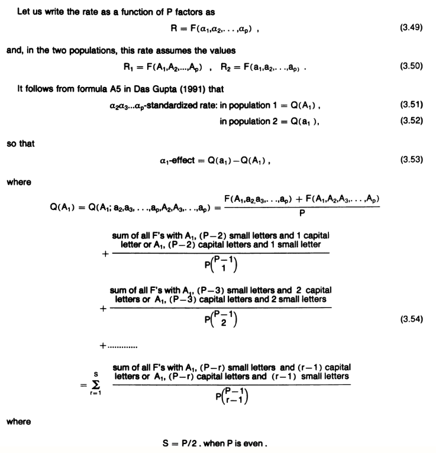
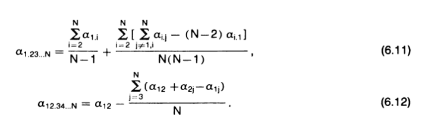
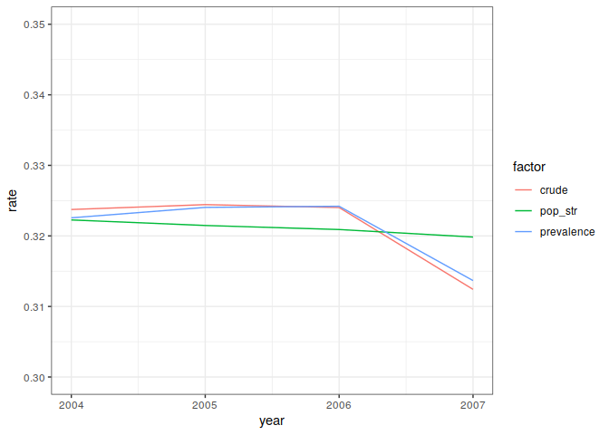
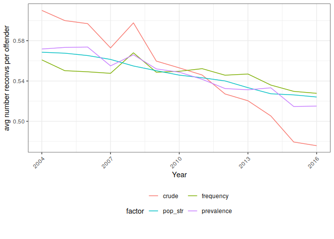

<!-- README.md is generated from README.Rmd. Please edit that file -->
DasGuptR
========

The goal of DasGuptR is to provide an implementation of Prithwis Das Gupta's specification of *standardization* and *decomposition* of rates[1].

Installation
------------

You can install DasGuptR from here with:

``` r
# install.packages("devtools")
devtools::install_github("josiahpjking/DasGuptR")
```

Background and worked examples
------------------------------

Standardization and decomposition are widely used analytic techniques to adjust for the impact of compositional factors on rates.

-   *Standardization*: Shows us what a rate would have been under different scenarios - for example, if there was no change in the age/sex structure of the population, or if there was no change in the prevalence of the event we are studying (e.g. reconviction).

-   *Decomposition*: Gives us the percentage of the difference in rates between two years attributable to each of the factors we have included in the standardization.

The *DasGuptR* package provides an implementation of Prithwis Das Gupta's specification of these two techniques.

Below we provide a brief background, and a worked an example of using the DasGuptR package to explore patterns of reconvictions in Scotland.

The Das Gupta Method
====================

Das Gupta's methodologies of standardisation and decomposition are explained in full in his 1993 book *[Standardization and decomposition of rates: A user's manual](https://babel.hathitrust.org/cgi/pt?id=osu.32437011198450)*

#### P factors, 2 populations

The essence of Das Gupta's method is that, given a set of P factors and 2 populations, one can calculate the rates adjusted for each combination of P-1 factors according to the formula below.  

  

We can interpret the P-*α* adjusted rate as 'what the crude rate would look like if only *α* had changed (all else being equal)'.

Neatly, crude rates can be decomposed into Das Gupta's adjusted rates such that changes in the P-*α* adjusted rate are proportional to changes in crude rates. For instance, if the crude rate decreases by 1.2, and the P-*α* adjusted rate decreases by .6, we can say that 50% of the change in crude rate is attributable to changes in *α*[2].
The change in the P-*α* adjusted rate is known as a *decomposition effect* (in this case the **α*-effect*).  


#### P factors, N populations

When we extend the standardisation and decomposition methodology to more than two populations, the starting point is to apply the same process on all pairwise comparisons of two populations at a time. However, the results of these pairwise comparisons are not internally consistent: We are left with multiple different adjusted rates for a given year, and the decomposition effects between populations are not additive.

Das Gupta provides a further process for standardizing the rates and decomposition effects across N populations, which can be applied to populations at given years for analysis of time series, which is as follows.

  

Where  
*α*<sub>1.23...N</sub> is the P-*α* adjusted rate for population 1 in the presence of populations 2-N.  
and *α*<sub>12.3...N</sub> is the *α*-effect between populations 1 and 2 when in the presence of populations 3-N.  
   
This process involves first calculating the P-1 adjusted rates and decompositions effects for all possible pairwise comparisons of populations, and then standardizing these across the N populations (by averaging over all possible ways of substituting adjusted rates to satisfy the condition B below, see Das Gupta 1993, p.106, equations 6.11 and 6.12) to obtain a consistent set of rates and effects for which:
  
-   **A:** there is only one P-*α* adjusted rate per population (as opposed to N-1)
-   **B:** the **α*-effect* from populations 1 and 2 and the **α*-effect* from populations 2 and 3 now sum to the **α*-effect* from populations 1 and 3.

Reconviction data
=================

Scottish Government publish an annual statistical bulletin on the [Reconviction Rates in Scotland](https://www.gov.scot/publications/reconviction-rates-scotland-2016-17-offender-cohort/). For the cohort of people convicted in a given year, it provides information on the numbers of reconvictions they have received. The headline figure in this bulletin is the *reconviction rate*, which is simply the percentage of offenders who have been reconvicted within the follow-up of one year. The bulletin published in 2019 showed that Scotland's reconviction rate has fallen steadily over the last fifteen years.

This sort of measure captures the prevalence of some event (i.e., prevalence of reconviction), but often also reflects underlying changes in, for example, the age/sex structure of the population. For example, if women over 40, who have a low average reconviction rate, made up a larger proportion of all people convicted then the overall reconviction rate would go down, even if the reconviction rate itself did not change for any age group. Scottish Government mention that the size of the under 21 group (relative to the size of the convicted population) has dropped over this period, referring to a fall in youth convictions as a "significant driver in the reduction in the overall national reconviction rate". Standardisation and decomposition offer a means of quantifying the influence of this sort of underlying change.

The DasGuptR package provides data on the reconviction rates in Scotland between 2004 and 2016, by age group and sex[3]. It includes data on the numbers of offenders, reconvictions, and reconvicted offenders in each age-sex group for offender cohorts between 2004 to 2016.

Below, we discuss two measures produced by Scottish Government:

-   *reconviction rate* : proportion of offenders who are reconvicted.
-   *average number of reconvictions per offender* : total number of reconvictions divided by number of offenders

``` r
library(tidyverse)
library(DasGuptR)
data(reconv)
str(reconv)
#> Classes 'tbl_df', 'tbl' and 'data.frame':    130 obs. of  7 variables:
#>  $ year                : int  2004 2004 2004 2004 2004 2004 2004 2004 2004 2004 ...
#>  $ Sex              : chr  "Female" "Female" "Female" "Female" ...
#>  $ Age                 : chr  "21 to 25" "26 to 30" "31 to 40" "over 40" ...
#>  $ convicted_population: num  49351 49351 49351 49351 49351 ...
#>  $ offenders           : num  1650 1268 2238 1198 1488 ...
#>  $ reconvicted         : num  576 420 558 212 424 ...
#>  $ reconvictions       : num  1145 786 963 361 858 ...
```

Reconviction rate
-----------------

To adjust the *reconviction rate* for the age/sex structure of the convicted population, we need to look at the measure in terms of the reconviction rates for the underlying age-sex groups.
The overall reconviction rate in a given year is simply the average of the reconviction rates for each group, *weighted by the size of the group*.

<table>
<thead>
<tr>
<th style="text-align:left;">
Sex
</th>
<th style="text-align:right;">
offenders
</th>
<th style="text-align:right;">
reconvicted
</th>
<th style="text-align:right;">
rate
</th>
</tr>
</thead>
<tbody>
<tr>
<td style="text-align:left;">
Female
</td>
<td style="text-align:right;">
7842
</td>
<td style="text-align:right;">
2190
</td>
<td style="text-align:right;">
0.279
</td>
</tr>
<tr>
<td style="text-align:left;">
Male
</td>
<td style="text-align:right;">
41509
</td>
<td style="text-align:right;">
13787
</td>
<td style="text-align:right;">
0.332
</td>
</tr>
<tr>
<td style="text-align:left;">
All
</td>
<td style="text-align:right;">
49351
</td>
<td style="text-align:right;">
15977
</td>
<td style="text-align:right;">
0.324
</td>
</tr>
</tbody>
</table>

``` r
weighted.mean(x=c(.279,.332),w=c(7842,41509))
#> [1] 0.3235782
```

Alternatively, we can calculate the *reconviction rate* as the product of 2 factors *A* and *B*,
where

-   *A* = reconviction rate for a given age-sex group
-   *B* = the proportion of convicted population (the 'offender cohort') who are in that age-sex group

The overall reconviction rate simply becomes the sum of these sub-group rates, *Σ*(*A* × *B*)

The table below (2004 reconviction rates) shows how the sex-specific reconviction rates (prop\_reconvicted) multiplied by the proportion of the population that group makes up (prop\_offenders) sum to the overall reconviction rate.

<table>
<thead>
<tr>
<th style="text-align:left;">
Sex
</th>
<th style="text-align:right;">
offenders
</th>
<th style="text-align:right;">
reconvicted
</th>
<th style="text-align:right;">
convicted_population
</th>
<th style="text-align:right;">
prop_reconvicted
</th>
<th style="text-align:right;">
prop_offenders
</th>
<th style="text-align:right;">
crude_rate
</th>
</tr>
</thead>
<tbody>
<tr>
<td style="text-align:left;">
Female
</td>
<td style="text-align:right;">
7842
</td>
<td style="text-align:right;">
2190
</td>
<td style="text-align:right;">
49351
</td>
<td style="text-align:right;">
0.28
</td>
<td style="text-align:right;">
0.16
</td>
<td style="text-align:right;font-weight: bold;">
0.04
</td>
</tr>
<tr>
<td style="text-align:left;">
Male
</td>
<td style="text-align:right;">
41509
</td>
<td style="text-align:right;">
13787
</td>
<td style="text-align:right;">
49351
</td>
<td style="text-align:right;">
0.33
</td>
<td style="text-align:right;">
0.84
</td>
<td style="text-align:right;font-weight: bold;">
0.28
</td>
</tr>
<tr>
<td style="text-align:left;font-weight: bold;color: white !important;background-color: #555555 !important;">
All
</td>
<td style="text-align:right;font-weight: bold;color: white !important;background-color: #555555 !important;">
49351
</td>
<td style="text-align:right;font-weight: bold;color: white !important;background-color: #555555 !important;">
15977
</td>
<td style="text-align:right;font-weight: bold;color: white !important;background-color: #555555 !important;">
49351
</td>
<td style="text-align:right;font-weight: bold;color: white !important;background-color: #555555 !important;">
0.32
</td>
<td style="text-align:right;font-weight: bold;color: white !important;background-color: #555555 !important;">
1.00
</td>
<td style="text-align:right;font-weight: bold;color: white !important;background-color: #555555 !important;font-weight: bold;">
0.32
</td>
</tr>
</tbody>
</table>

Average number of reconvictions per offender
--------------------------------------------

A further measure provided by Scottish Government [(previously a National Indicator)](https://www2.gov.scot/About/Performance/scotPerforms/indicator/reconviction), is the *average number of reconvictions per offender*. The measure, as well as being influenced by changes in the age-sex structure of the population and changes in the prevalence of reconviction, may reflect changes in the frequency with offenders are reconvicted.

The *average number of reconvictions per offender* in a given year can be written as:

*Σ*(*A* × *B* × *C*)

where

-   *A* = the frequency with which reconvicted offenders are reconvicted in a given age-sex group
-   *B* = the proportion of offenders in a given age-sex group who are reconvicted (the reconviction rate for that group)
-   *C* = the proportion of convicted population who are in that age-sex group

Again, the sex-specific crude rates in the table below (freq\_reconvicted × prop\_reconvicted × prop\_offenders) sum to the overall average number of reconvictions per offender. Note that this measure is more easily calculated as simply the *number of reconvictions/number of offenders*, but by separating out into two factors of prevalence (*number reconvicted/number of offenders*) and frequency (*number of reconvictions/number reconvicted*) we can investigate the extent to which changes in the *average number of reconvictions per offender* are due to a) the percentages of offenders who are reconvicted, or b) the frequency with which reconvicted offenders are reconvicted.

<table>
<thead>
<tr>
<th style="text-align:left;">
Sex
</th>
<th style="text-align:right;">
reconvicted
</th>
<th style="text-align:right;">
reconvictions
</th>
<th style="text-align:right;">
freq_reconvicted
</th>
<th style="text-align:right;">
prop_reconvicted
</th>
<th style="text-align:right;">
prop_offenders
</th>
<th style="text-align:right;">
crude_rate
</th>
</tr>
</thead>
<tbody>
<tr>
<td style="text-align:left;">
Female
</td>
<td style="text-align:right;">
2190
</td>
<td style="text-align:right;">
4113
</td>
<td style="text-align:right;">
1.88
</td>
<td style="text-align:right;font-weight: bold;">
0.28
</td>
<td style="text-align:right;">
0.16
</td>
<td style="text-align:right;">
0.08
</td>
</tr>
<tr>
<td style="text-align:left;">
Male
</td>
<td style="text-align:right;">
13787
</td>
<td style="text-align:right;">
25992
</td>
<td style="text-align:right;">
1.89
</td>
<td style="text-align:right;font-weight: bold;">
0.33
</td>
<td style="text-align:right;">
0.84
</td>
<td style="text-align:right;">
0.53
</td>
</tr>
<tr>
<td style="text-align:left;font-weight: bold;color: white !important;background-color: #555555 !important;">
All
</td>
<td style="text-align:right;font-weight: bold;color: white !important;background-color: #555555 !important;">
15977
</td>
<td style="text-align:right;font-weight: bold;color: white !important;background-color: #555555 !important;">
30105
</td>
<td style="text-align:right;font-weight: bold;color: white !important;background-color: #555555 !important;">
1.88
</td>
<td style="text-align:right;font-weight: bold;color: white !important;background-color: #555555 !important;font-weight: bold;">
0.32
</td>
<td style="text-align:right;font-weight: bold;color: white !important;background-color: #555555 !important;">
1.00
</td>
<td style="text-align:right;font-weight: bold;color: white !important;background-color: #555555 !important;">
0.61
</td>
</tr>
</tbody>
</table>

Other rates as a function F of factors
--------------------------------------

While both of the reconviction measures above can be calculated as the product of different factors, other rates might be specific functions of factors, for example:

Crude rate of natural increase = *A* − *B*

-   *A* = crude birth rate
-   *B* = crude death rate

Or a more complex example:

Crude birth rate per 1,000 population = *\[AB + C(1-B)\]D*

-   *A* = marital births per 1,000 married women aged 15 to 49
-   *B* = proportion of married women among all women aged 15 to 49
-   *C* = Nonmarital births per 1,000 unmarried women aged 15 to 49
-   *D* = proportion of women aged 15 to 49 in the total population

Standardisation and decomposition with the DasGuptR package
===========================================================

Standardization and decomposition via Das Gupta's formulae can be achieved in R via the **DasGupt\_Npop()** function.

Suitable data requires a column specifying the population (e.g., *year* in the reconv data), and a column for each of the factors we wish to include in the decomposition.
For example, if we are interested in decomposing the *average number of reconvictions per offender* into the prevalence and frequency of reconviction, then the first 3 columns of the following will suffice:

<table>
<thead>
<tr>
<th style="border-bottom:hidden; padding-bottom:0; padding-left:3px;padding-right:3px;text-align: center; color: grey70 !important;padding-right: 4px; padding-left: 4px; background-color: white !important;" colspan="1">
Population

</th>
<th style="border-bottom:hidden; padding-bottom:0; padding-left:3px;padding-right:3px;text-align: center; color: grey70 !important;padding-right: 4px; padding-left: 4px; background-color: white !important;" colspan="2">
Decomposition Factors

</th>
<th style="border-bottom:hidden; padding-bottom:0; padding-left:3px;padding-right:3px;text-align: center; color: grey70 !important;padding-right: 4px; padding-left: 4px; background-color: white !important;" colspan="3">
Raw numbers

</th>
</tr>
<tr>
<th style="text-align:left;">
year
</th>
<th style="text-align:left;">
prevalence
</th>
<th style="text-align:left;">
frequency
</th>
<th style="text-align:left;">
offenders
</th>
<th style="text-align:left;">
reconvicted
</th>
<th style="text-align:left;">
reconvictions
</th>
</tr>
</thead>
<tbody>
<tr>
<td style="text-align:left;font-weight: bold;color: white !important;background-color: #D7261E !important;">
2004
</td>
<td style="text-align:left;font-weight: bold;color: white !important;background-color: #D7261E !important;">
0.324
</td>
<td style="text-align:left;font-weight: bold;color: white !important;background-color: #D7261E !important;">
1.884
</td>
<td style="text-align:left;color: grey10 !important;">
49351
</td>
<td style="text-align:left;color: grey10 !important;">
15977
</td>
<td style="text-align:left;color: grey10 !important;">
30105
</td>
</tr>
<tr>
<td style="text-align:left;font-weight: bold;color: white !important;background-color: #D7261E !important;">
2005
</td>
<td style="text-align:left;font-weight: bold;color: white !important;background-color: #D7261E !important;">
0.324
</td>
<td style="text-align:left;font-weight: bold;color: white !important;background-color: #D7261E !important;">
1.849
</td>
<td style="text-align:left;color: grey10 !important;">
50343
</td>
<td style="text-align:left;color: grey10 !important;">
16333
</td>
<td style="text-align:left;color: grey10 !important;">
30202
</td>
</tr>
<tr>
<td style="text-align:left;font-weight: bold;color: white !important;background-color: #D7261E !important;">
2006
</td>
<td style="text-align:left;font-weight: bold;color: white !important;background-color: #D7261E !important;">
0.324
</td>
<td style="text-align:left;font-weight: bold;color: white !important;background-color: #D7261E !important;">
1.842
</td>
<td style="text-align:left;color: grey10 !important;">
53305
</td>
<td style="text-align:left;color: grey10 !important;">
17272
</td>
<td style="text-align:left;color: grey10 !important;">
31816
</td>
</tr>
<tr>
<td style="text-align:left;font-weight: bold;color: white !important;background-color: #D7261E !important;">
2007
</td>
<td style="text-align:left;font-weight: bold;color: white !important;background-color: #D7261E !important;">
0.312
</td>
<td style="text-align:left;font-weight: bold;color: white !important;background-color: #D7261E !important;">
1.834
</td>
<td style="text-align:left;color: grey10 !important;">
53044
</td>
<td style="text-align:left;color: grey10 !important;">
16572
</td>
<td style="text-align:left;color: grey10 !important;">
30385
</td>
</tr>
<tr>
<td style="text-align:left;font-weight: bold;color: white !important;background-color: #D7261E !important;">
2008
</td>
<td style="text-align:left;font-weight: bold;color: white !important;background-color: #D7261E !important;">
0.315
</td>
<td style="text-align:left;font-weight: bold;color: white !important;background-color: #D7261E !important;">
1.896
</td>
<td style="text-align:left;color: grey10 !important;">
49665
</td>
<td style="text-align:left;color: grey10 !important;">
15653
</td>
<td style="text-align:left;color: grey10 !important;">
29682
</td>
</tr>
<tr>
<td style="text-align:left;font-weight: bold;color: white !important;background-color: #D7261E !important;">
2009
</td>
<td style="text-align:left;font-weight: bold;color: white !important;background-color: #D7261E !important;">
0.306
</td>
<td style="text-align:left;font-weight: bold;color: white !important;background-color: #D7261E !important;">
1.831
</td>
<td style="text-align:left;color: grey10 !important;">
47416
</td>
<td style="text-align:left;color: grey10 !important;">
14491
</td>
<td style="text-align:left;color: grey10 !important;">
26539
</td>
</tr>
<tr>
<td style="text-align:left;font-weight: bold;color: white !important;background-color: #D7261E !important;">
...
</td>
<td style="text-align:left;font-weight: bold;color: white !important;background-color: #D7261E !important;">
...
</td>
<td style="text-align:left;font-weight: bold;color: white !important;background-color: #D7261E !important;">
...
</td>
<td style="text-align:left;color: grey10 !important;">
...
</td>
<td style="text-align:left;color: grey10 !important;">
...
</td>
<td style="text-align:left;color: grey10 !important;">
...
</td>
</tr>
</tbody>
</table>

If we are also interested in including the underlying structure of the population (e.g. age and sex sub-groups) in the decomposition, then each row should identify the sub-group via a set of id variables (i.e., age and sex), with a column specifying the proportion of the population made up by that sub-group (the pop\_str variable below):

<table>
<thead>
<tr>
<th style="border-bottom:hidden; padding-bottom:0; padding-left:3px;padding-right:3px;text-align: center; color: grey70 !important;padding-right: 4px; padding-left: 4px; background-color: white !important;" colspan="1">
Population

</th>
<th style="border-bottom:hidden; padding-bottom:0; padding-left:3px;padding-right:3px;text-align: center; color: grey70 !important;padding-right: 4px; padding-left: 4px; background-color: white !important;" colspan="2">
ID variables

</th>
<th style="border-bottom:hidden; padding-bottom:0; padding-left:3px;padding-right:3px;text-align: center; color: grey70 !important;padding-right: 4px; padding-left: 4px; background-color: white !important;" colspan="3">
Decomposition factors

</th>
<th style="border-bottom:hidden; padding-bottom:0; padding-left:3px;padding-right:3px;text-align: center; color: grey70 !important;padding-right: 4px; padding-left: 4px; background-color: white !important;" colspan="3">
Raw numbers

</th>
</tr>
<tr>
<th style="text-align:left;">
year
</th>
<th style="text-align:left;">
Sex
</th>
<th style="text-align:left;">
Age
</th>
<th style="text-align:left;">
prevalence
</th>
<th style="text-align:left;">
frequency
</th>
<th style="text-align:left;">
pop_str
</th>
<th style="text-align:left;">
offenders
</th>
<th style="text-align:left;">
reconvicted
</th>
<th style="text-align:left;">
reconvictions
</th>
</tr>
</thead>
<tbody>
<tr>
<td style="text-align:left;font-weight: bold;color: white !important;background-color: #D7261E !important;">
2004
</td>
<td style="text-align:left;font-weight: bold;color: white !important;background-color: #D7261E !important;">
Female
</td>
<td style="text-align:left;font-weight: bold;color: white !important;background-color: #D7261E !important;">
21 to 25
</td>
<td style="text-align:left;font-weight: bold;color: white !important;background-color: #D7261E !important;">
0.349
</td>
<td style="text-align:left;font-weight: bold;color: white !important;background-color: #D7261E !important;">
1.988
</td>
<td style="text-align:left;font-weight: bold;color: white !important;background-color: #D7261E !important;">
0.033
</td>
<td style="text-align:left;color: grey10 !important;">
1650
</td>
<td style="text-align:left;color: grey10 !important;">
576
</td>
<td style="text-align:left;color: grey10 !important;">
1145
</td>
</tr>
<tr>
<td style="text-align:left;font-weight: bold;color: white !important;background-color: #D7261E !important;">
2004
</td>
<td style="text-align:left;font-weight: bold;color: white !important;background-color: #D7261E !important;">
Female
</td>
<td style="text-align:left;font-weight: bold;color: white !important;background-color: #D7261E !important;">
26 to 30
</td>
<td style="text-align:left;font-weight: bold;color: white !important;background-color: #D7261E !important;">
0.331
</td>
<td style="text-align:left;font-weight: bold;color: white !important;background-color: #D7261E !important;">
1.871
</td>
<td style="text-align:left;font-weight: bold;color: white !important;background-color: #D7261E !important;">
0.026
</td>
<td style="text-align:left;color: grey10 !important;">
1268
</td>
<td style="text-align:left;color: grey10 !important;">
420
</td>
<td style="text-align:left;color: grey10 !important;">
786
</td>
</tr>
<tr>
<td style="text-align:left;font-weight: bold;color: white !important;background-color: #D7261E !important;">
2004
</td>
<td style="text-align:left;font-weight: bold;color: white !important;background-color: #D7261E !important;">
Female
</td>
<td style="text-align:left;font-weight: bold;color: white !important;background-color: #D7261E !important;">
31 to 40
</td>
<td style="text-align:left;font-weight: bold;color: white !important;background-color: #D7261E !important;">
0.249
</td>
<td style="text-align:left;font-weight: bold;color: white !important;background-color: #D7261E !important;">
1.726
</td>
<td style="text-align:left;font-weight: bold;color: white !important;background-color: #D7261E !important;">
0.045
</td>
<td style="text-align:left;color: grey10 !important;">
2238
</td>
<td style="text-align:left;color: grey10 !important;">
558
</td>
<td style="text-align:left;color: grey10 !important;">
963
</td>
</tr>
<tr>
<td style="text-align:left;font-weight: bold;color: white !important;background-color: #D7261E !important;">
2004
</td>
<td style="text-align:left;font-weight: bold;color: white !important;background-color: #D7261E !important;">
Female
</td>
<td style="text-align:left;font-weight: bold;color: white !important;background-color: #D7261E !important;">
over 40
</td>
<td style="text-align:left;font-weight: bold;color: white !important;background-color: #D7261E !important;">
0.177
</td>
<td style="text-align:left;font-weight: bold;color: white !important;background-color: #D7261E !important;">
1.703
</td>
<td style="text-align:left;font-weight: bold;color: white !important;background-color: #D7261E !important;">
0.024
</td>
<td style="text-align:left;color: grey10 !important;">
1198
</td>
<td style="text-align:left;color: grey10 !important;">
212
</td>
<td style="text-align:left;color: grey10 !important;">
361
</td>
</tr>
<tr>
<td style="text-align:left;font-weight: bold;color: white !important;background-color: #D7261E !important;">
2004
</td>
<td style="text-align:left;font-weight: bold;color: white !important;background-color: #D7261E !important;">
Female
</td>
<td style="text-align:left;font-weight: bold;color: white !important;background-color: #D7261E !important;">
under 21
</td>
<td style="text-align:left;font-weight: bold;color: white !important;background-color: #D7261E !important;">
0.285
</td>
<td style="text-align:left;font-weight: bold;color: white !important;background-color: #D7261E !important;">
2.024
</td>
<td style="text-align:left;font-weight: bold;color: white !important;background-color: #D7261E !important;">
0.03
</td>
<td style="text-align:left;color: grey10 !important;">
1488
</td>
<td style="text-align:left;color: grey10 !important;">
424
</td>
<td style="text-align:left;color: grey10 !important;">
858
</td>
</tr>
<tr>
<td style="text-align:left;font-weight: bold;color: white !important;background-color: #D7261E !important;">
2004
</td>
<td style="text-align:left;font-weight: bold;color: white !important;background-color: #D7261E !important;">
Male
</td>
<td style="text-align:left;font-weight: bold;color: white !important;background-color: #D7261E !important;">
21 to 25
</td>
<td style="text-align:left;font-weight: bold;color: white !important;background-color: #D7261E !important;">
0.367
</td>
<td style="text-align:left;font-weight: bold;color: white !important;background-color: #D7261E !important;">
1.927
</td>
<td style="text-align:left;font-weight: bold;color: white !important;background-color: #D7261E !important;">
0.181
</td>
<td style="text-align:left;color: grey10 !important;">
8941
</td>
<td style="text-align:left;color: grey10 !important;">
3285
</td>
<td style="text-align:left;color: grey10 !important;">
6330
</td>
</tr>
<tr>
<td style="text-align:left;font-weight: bold;color: white !important;background-color: #D7261E !important;">
...
</td>
<td style="text-align:left;font-weight: bold;color: white !important;background-color: #D7261E !important;">
...
</td>
<td style="text-align:left;font-weight: bold;color: white !important;background-color: #D7261E !important;">
...
</td>
<td style="text-align:left;font-weight: bold;color: white !important;background-color: #D7261E !important;">
...
</td>
<td style="text-align:left;font-weight: bold;color: white !important;background-color: #D7261E !important;">
...
</td>
<td style="text-align:left;font-weight: bold;color: white !important;background-color: #D7261E !important;">
...
</td>
<td style="text-align:left;color: grey10 !important;">
...
</td>
<td style="text-align:left;color: grey10 !important;">
...
</td>
<td style="text-align:left;color: grey10 !important;">
...
</td>
</tr>
</tbody>
</table>

The second thing we require is the function F by which the rate is to be calculated from the decomposition factors.
In our two examples of the *reconviction rate* and *average number of reconvictions per offender*, rates are simply the product of factors.

-   reconviction rate = prevalence × pop\_str
-   avg number reconvs per offender = prevalence × frequency × pop\_str

(When we're not disaggregating by population structure, the "pop\_str" factor remains implicitly present with a value of 1 (thereby having no impact).

### Standardizing and decomposing Scotland's reconviction rate

The code below decomposes the Scotland's reconviction rates for 2004 to 2007 into prevalence and age-sex structure of the convicted population. We focus initially on this small period of time simply because the output becomes cumbersome as the the number of populations increases.

``` r
# create our decomposition factors
reconv <- 
  reconv %>% 
  mutate(
    prevalence = reconvicted/offenders,
    frequency = reconvictions/reconvicted, #not used here
    pop_str = offenders/convicted_population
  ) %>% 
  filter(year %in% 2004:2007) #the output is pretty cumbersome, so lets keep it at 4 years for now

#standardize and decompose!
reconv_DG <- DasGupt_Npop(df=reconv,
                          pop=year,
                          prevalence, pop_str,
                          id_vars=c(Age,Sex),
                          ratefunction="prevalence*pop_str")
                          # the default ratefunction calculates rate as the product of all specified factors
                          # in theory this function works with any function you like.
```

The DasGupt\_Npop() function returns a tibble with a column for the P-*α* adjusted rates ("pop"- columns) in each population (see below). The 'factor' column specifies *α*.

It also returns the standardized decomposition *α* effects ("diff"- columns) for each pairwise comparison of populations (again, the 'factor' column specifies *α*)

``` r
str(reconv_DG)
#> Classes 'tbl_df', 'tbl' and 'data.frame':    20 obs. of  19 variables:
#>  $ Age          : chr  "21 to 25" "26 to 30" "31 to 40" "over 40" ...
#>  $ Sex       : chr  "Female" "Female" "Female" "Female" ...
#>  $ pop2004      : num  0.01121 0.0087 0.01086 0.00484 0.00904 ...
#>  $ pop2005      : num  0.00993 0.00831 0.01045 0.00439 0.00907 ...
#>  $ pop2006      : num  0.01015 0.00848 0.01105 0.00481 0.00936 ...
#>  $ pop2007      : num  0.00981 0.00803 0.01095 0.00478 0.00914 ...
#>  $ diff2004_2005: num  -1.28e-03 -3.87e-04 -4.10e-04 -4.49e-04 3.46e-05 ...
#>  $ diff2004_2006: num  -1.06e-03 -2.17e-04 1.83e-04 -3.26e-05 3.29e-04 ...
#>  $ diff2004_2007: num  -1.40e-03 -6.62e-04 8.98e-05 -6.56e-05 1.05e-04 ...
#>  $ diff2005_2006: num  0.000226 0.000169 0.000593 0.000417 0.000294 ...
#>  $ diff2005_2007: num  -1.16e-04 -2.75e-04 5.00e-04 3.84e-04 7.06e-05 ...
#>  $ diff2006_2007: num  -3.42e-04 -4.44e-04 -9.36e-05 -3.30e-05 -2.24e-04 ...
#>  $ diff2005_2004: num  1.28e-03 3.87e-04 4.10e-04 4.49e-04 -3.46e-05 ...
#>  $ diff2006_2004: num  1.06e-03 2.17e-04 -1.83e-04 3.26e-05 -3.29e-04 ...
#>  $ diff2007_2004: num  1.40e-03 6.62e-04 -8.98e-05 6.56e-05 -1.05e-04 ...
#>  $ diff2006_2005: num  -0.000226 -0.000169 -0.000593 -0.000417 -0.000294 ...
#>  $ diff2007_2005: num  1.16e-04 2.75e-04 -5.00e-04 -3.84e-04 -7.06e-05 ...
#>  $ diff2007_2006: num  3.42e-04 4.44e-04 9.36e-05 3.30e-05 2.24e-04 ...
#>  $ factor       : chr  "prevalence" "prevalence" "prevalence" "prevalence" ...
```

The returning rates and decomposition effects are age-sex specific (i.e., they are *A* × *B* for each sub-group). Recalling that *B* is the proportions of the population that each group constitutes, the sum of these age-sex specific rates gives us the overall rates.
We can extract these population rates with the **DasGupt\_rates()** function, which simply groups by *α* (the factor not being adjusted for), sums, and reshapes.

``` r
DasGupt_rates(reconv_DG)
#> # A tibble: 8 x 3
#>   factor     population  rate
#>   <chr>      <chr>      <dbl>
#> 1 pop_str    2004       0.322
#> 2 prevalence 2004       0.323
#> 3 pop_str    2005       0.321
#> 4 prevalence 2005       0.324
#> 5 pop_str    2006       0.321
#> 6 prevalence 2006       0.324
#> 7 pop_str    2007       0.320
#> 8 prevalence 2007       0.314
```

Here the output is somewhat counterintuitive. It is important to remembe that the 'factor' column here represents the ***α* and not the P** in the expression "P-*α* adjusted rate". It can become mightily confusing, for instance, that to investigate the "age/sex adjusted rates", requires looking at the rates where `factor=="prevalence"`.

We can plot the adjusted rates alongside the crude rates...

``` r
crude_rates <-
  reconv %>%
  mutate(rate=prevalence*pop_str) %>%
  group_by(year) %>% 
  summarise(
    rate=sum(rate),
    factor="crude"
  )

DasGupt_rates(reconv_DG) %>%
  mutate(year=as.numeric(population)) %>%
  bind_rows(., crude_rates) %>%  
  ggplot(.,aes(x=year,y=rate,col=factor))+geom_path()+theme_bw()+
  ylim(.3,.35)
```



We can then compare the change in the adjusted rates to the change in the crude rates, to give what equates to an effect size:

``` r
bind_rows(
  DasGupt_table(reconv_DG,2004,2007),
  crude_rates %>% filter(year %in% c(2004,2007)) %>%
    spread(year,rate) %>% mutate(difference=`2004`-`2007`)
) %>%
  mutate(percentage_of_unadjusted=100*(difference/difference[factor=="crude"])) %>%
  kable(.,digits=3)
```

<table>
<thead>
<tr>
<th style="text-align:left;">
factor
</th>
<th style="text-align:right;">
2004
</th>
<th style="text-align:right;">
2007
</th>
<th style="text-align:right;">
difference
</th>
<th style="text-align:right;">
percentage_of_unadjusted
</th>
</tr>
</thead>
<tbody>
<tr>
<td style="text-align:left;">
pop_str
</td>
<td style="text-align:right;">
0.322
</td>
<td style="text-align:right;">
0.320
</td>
<td style="text-align:right;">
0.002
</td>
<td style="text-align:right;">
21.39
</td>
</tr>
<tr>
<td style="text-align:left;">
prevalence
</td>
<td style="text-align:right;">
0.323
</td>
<td style="text-align:right;">
0.314
</td>
<td style="text-align:right;">
0.009
</td>
<td style="text-align:right;">
78.61
</td>
</tr>
<tr>
<td style="text-align:left;">
crude
</td>
<td style="text-align:right;">
0.324
</td>
<td style="text-align:right;">
0.312
</td>
<td style="text-align:right;">
0.011
</td>
<td style="text-align:right;">
100.00
</td>
</tr>
</tbody>
</table>
From this, we can say that had the prevalence of reconvictions remained equal, the changing age-sex structure of the convicted population would have resulted in a change in the overall reconviction rate of 21.4% the size of the actual change.
This is useful because we can now get a measrue of how much changes in the overall reconviction rate are due to fewer people being reconvicted vs how much is due to the changing age-sex mix of the convicted population (e.g., if younger people tend to have higher reconviction rates, but are becoming more frequently [diverted from prosecution](http://scottishjusticematters.com/wp-content/uploads/Shrinking-YJ-population-SJM_5-1_April2017-18.pdf), then younger groups will begin to make up a smaller proportion of the convicted population, and so the overall rate at which the population is reconvicted will go down even if the rates at which different sub-groups are reconvicted do not).

Standardizing and decomposing the average number of reconvictions per offender
------------------------------------------------------------------------------

Scottish Government's second measure, the *average number of reconvictions per offender*, also captures changes in the frequency with which offenders are reconvicted. It is therefore possible to decompose this rate into the prevalence and frequency of reconviction, as well as age-sex structure of the population:

``` r
#reload the data
data(reconv)

reconv <- 
  reconv %>% 
  mutate(
    prevalence = reconvicted/offenders,
    frequency = reconvictions/reconvicted,
    pop_str = offenders/convicted_population
  ) 

reconv_DG <- DasGupt_Npop(df=reconv,
                          pop=year,prevalence, pop_str,frequency,
                          id_vars=c(Age,Sex),ratefunction="prevalence*pop_str*frequency")

crude_rates <-
  reconv %>%
  mutate(rate=prevalence*pop_str*frequency) %>%
  group_by(year) %>% 
  summarise(
    rate=sum(rate),
    factor="crude"
  )

DasGupt_rates(reconv_DG) %>%
  mutate(year=as.numeric(population)) %>%
  bind_rows(., crude_rates) %>%  
  ggplot(.,aes(x=year,y=rate,col=factor))+geom_path()+theme_bw()+
  theme(legend.position="bottom",axis.text.x = element_text(angle = 45, hjust = 1)) +
  guides(colour = guide_legend(nrow = 3, byrow = TRUE)) +
  labs(y = "avg number reconvs per offender",
       x = "Year")
```



[1] As set out in his 1993 book *[Standardization and decomposition of rates: A user's manual](https://babel.hathitrust.org/cgi/pt?id=osu.32437011198450)*.

[2] Importantly, this analysis is not causal as the different decomposition effects identified by standardization and decomposition may themselves be the products of one (or more) variables not included in the analysis (Das Gupta 1993:4).

[3] Data was extracted from [Scottish Government's 2016/17 reconviction bulletin and accompanying tables (published June 2019)](https://www.gov.scot/publications/reconviction-rates-scotland-2016-17-offender-cohort/). Mid-year population estimates were taken from the [National Records of Scotland time series data](https://www.nrscotland.gov.uk/statistics-and-data/statistics/statistics-by-theme/population/population-estimates/mid-year-population-estimates/population-estimates-time-series-data).
