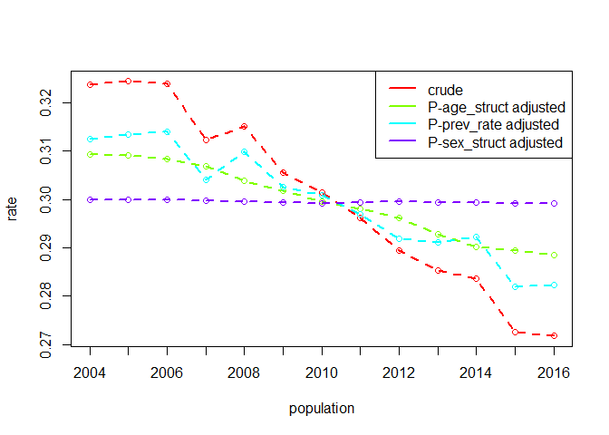

- [DasGuptR](#dasguptr)
- [Background and worked examples](#background-and-worked-examples)
- [DasGuptR functionality](#dasguptr-functionality)
- [Vector factors, Rates as functions, Cross-classified data, and N
  populations](#vector-factors-rates-as-functions-cross-classified-data-and-n-populations)
  - [P factors](#p-factors)
    - [2 factors, 2 populations, R=ab](#2-factors-2-populations-rab)
    - [3 factors, 2 populations, R=abc](#3-factors-2-populations-rabc)
    - [4 factors, 2 populations, R=abcd](#4-factors-2-populations-rabcd)
    - [5 factors, 2 populations,
      R=abcde](#5-factors-2-populations-rabcde)
  - [Vector factors](#vector-factors)
    - [3 vector factors, 2 populations,
      R=sum(abc)](#3-vector-factors-2-populations-rsumabc)
  - [Rates as functions](#rates-as-functions)
    - [4 vector factors, 2 populations,
      R=f(a,b,c,d)](#4-vector-factors-2-populations-rfabcd)
    - [2 vector factors, 2 populations,
      R=f(a,b)](#2-vector-factors-2-populations-rfab)
  - [Population structures and cross-classified
    data](#population-structures-and-cross-classified-data)
    - [population structure as a vector factor, 2 populations,
      R=sum(w\*r_i)](#population-structure-as-a-vector-factor-2-populations-rsumwr_i)
    - [cross-classified population structure, 2 populations,
      R=sum(w\*r_i)](#cross-classified-population-structure-2-populations-rsumwr_i)
  - [N populations](#n-populations)
    - [4 vector factors, 5 populations, R =
      f(a,b,c,d)](#4-vector-factors-5-populations-r--fabcd)
  - [Re-expression of population
    structures:](#re-expression-of-population-structures)
  - [Example: US population data](#example-us-population-data)
  - [Example: Scottish Reconvictions](#example-scottish-reconvictions)

# DasGuptR

The goal of the DasGuptR package is to provide an implementation of
Prithwith Das Gupta’s specification of *standardization* and
*decomposition* of rates, as set out in his 1993 book *[Standardization
and decomposition of rates: A user’s
manual](https://babel.hathitrust.org/cgi/pt?id=osu.32437011198450)*.

You can install DasGuptR from here with:

``` r
# install.packages("devtools")
devtools::install_github("josiahpjking/DasGuptR")
```

# Background and worked examples

Standardization and decomposition are widely used analytic techniques to
adjust for the impact of compositional factors on rates.

- *Standardization*/*Adjustment*: Shows us what a rate would have been
  under different scenarios - for example, if there was no difference in
  the age-structure of the population, or if there was no change in the
  age-specific rates of the event we are studying.

- *Decomposition*: Gives us the percentage of the difference in rates
  between two years attributable to each of the factors we have included
  in the standardization.

In the simplest example, consider a case where the rate is taken as the
product of two factors $\alpha$ and $\beta$, which we will write as
$R = \alpha\beta$. Throughout Das Gupta’s work, greek letters are used
to indicate the different compositional factors, and upper and lower
case latin letters are used to denote specific population values of
these:

|            | pop1 | pop2 |
|------------|------|------|
| $\alpha$   | $A$  | $a$  |
| $\beta$    | $B$  | $b$  |
| crude rate | $AB$ | $ab$ |

In this simple case, we can standardise across the two populations,
calculating $\alpha$-adjusted (or “$\alpha$-standardised”) rates by
replacing $A$ and $a$ with $\frac{a+A}{2}$.

|                                        | pop1             | pop2             |
|----------------------------------------|------------------|------------------|
| $\alpha$                               | $A$              | $a$              |
| $\beta$                                | $B$              | $b$              |
| crude rate, $R_{crude}$                | $AB$             | $ab$             |
| “$\beta$-adjusted rate”, $R_{-\alpha}$ | $A\frac{B+b}{2}$ | $a\frac{B+b}{2}$ |
| “$\alpha$-adjusted rate”, $R_{-\beta}$ | $\frac{A+a}{2}B$ | $\frac{A+a}{2}b$ |

These $\alpha$-adjusted rates can be interpreted as “what the crude rate
would look like if $\alpha$ was held equal” (and analogously for
$\beta$). In cases involving multiple factors, this can quickly become
unwieldy, requiring listing the $P-1$ factors that are held equal for
each standardised rate.[^1] For this reason, we opt to refer to these
rates as, e.g., $P-\alpha$, where $P$ is the set of all compositional
factors. This is reflected in the table above, where we have used
$R_{crude}$, $R_{-\alpha}$ and $R_{-\beta}$ to denote, respectively, the
crude rate, the $P-\alpha$-adjusted rate (or “$\beta$-adjusted”), and
the $P-\beta$-adjusted (or “$\alpha$-adjusted”) rate. The
$P-\alpha$-adjusted rate can therefore be interpreted as “what the crude
rate would look like if $\alpha$ changed but all other factors were held
equal”.

The *difference* in the adjusted/standardised rates is known as a
**decomposition effect**, so named because differences in the crude
rates can be decomposed into differences in adjusted rates:
$\Delta R_{crude} = \Delta R_{-\alpha} + \Delta R_{-\beta}$. This
decomposition allows us to quantify how much of the difference between
two crude rates is attributable to differences in $\alpha$, differences
in $\beta$, and so on. [^2]

# DasGuptR functionality

Consider an example of the simple case described above (2 factors, 2
populations).

DasGuptR requires data to be in long format, with columns for each
factor, and a single variable denoting the population:

``` r
eg.dg <- data.frame(
  pop = c("pop1","pop2"),
  alpha = c(.6,.3),
  beta = c(.5,.45)
)
eg.dg
#>    pop alpha beta
#> 1 pop1   0.6 0.50
#> 2 pop2   0.3 0.45
```

In this case, the calculations for the adjusted rates can easily be
calculated manually:

``` r
data.frame(
  pop = c("pop1","pop2"),
  Rcrude = c(.6*.5, .3*.45),
  R_alpha = c(.6,.3) * ((.5+.45)/2),
  R_beta = ((.6+.3)/2) * c(.5,.45)
)
#>    pop Rcrude R_alpha R_beta
#> 1 pop1  0.300  0.2850 0.2250
#> 2 pop2  0.135  0.1425 0.2025
```

The workhorse of the DasGuptR package is `dgnpop()`, which computes the
adjusted rates for $P$ factors across $N$ populations:

``` r
dgnpop(eg.dg, pop = "pop", factors = c("alpha","beta"))
#>     rate  pop std.set factor
#> 1 0.3000 pop1    <NA>  crude
#> 2 0.1350 pop2    <NA>  crude
#> 3 0.2850 pop1    pop2  alpha
#> 4 0.1425 pop2    pop1  alpha
#> 5 0.2250 pop1    pop2   beta
#> 6 0.2025 pop2    pop1   beta
```

These can be quickly turned into a wide table in the style of Das Gupta
using `dg_table()`. When working with just two populations, this also
provides the difference in rates, and expresses them as the percentage
of the crude rate difference:

``` r
dgnpop(eg.dg, pop = "pop", factors = c("alpha","beta")) |>
  dg_table()
#>        pop1   pop2    diff decomp
#> alpha 0.285 0.1425 -0.1425  86.36
#> beta  0.225 0.2025 -0.0225  13.64
#> crude 0.300 0.1350 -0.1650 100.00
```

In addition to the tabular form, `dg_plot()` will create a rough plot of
the adjusted rates, although this is really only useful when working
with many populations, such as with time series data.

``` r
dgnpop(eg.dg, pop = "pop", factors = c("alpha","beta")) |>
  dg_plot()
```


# Vector factors, Rates as functions, Cross-classified data, and N populations

Rates may be composed of many factors, and they may not be calculated as
a simple product. Additionally, we may desire to standardise across many
populations — such as in a time series — or we may have be interested in
how the compositional structure of populations contributes to the
differences in these rates.

The full explanation of Das Gupta’s methodology for standardisation and
decomposition are explained in full in his 1993 book *[Standardization
and decomposition of rates: A user’s
manual](https://babel.hathitrust.org/cgi/pt?id=osu.32437011198450)*

Below are various examples taken from Das Gupta’s 1993 work, following
his exposition by building up the number of factors, vectorisation,
generalising to different rate functions, compositional structures of
populations, and finally extending the process to more than just two
populations.

## P factors

The addition of factors into the make up of a population rate is handled
in `dgnpop()` by simply adding the variable name into the `factors`
argument. The default behaviour will take the rate to be the product of
all factors specified.

### 2 factors, 2 populations, R=ab

- Mean earnings as product of two factors for black males and white
  males 18 years and over, US 1980
  - Crude Rate = total earnings / total population
  - `avg_earnings` = total earnings / persons who earned
  - `earner_prop` = persons who earned / total population

``` r
eg2.1 <- data.frame(
  pop = c("black","white"),
  avg_earnings = c(10930, 16591),
  earner_prop = c(.717892, .825974)
)

dgnpop(eg2.1, pop = "pop", factors = c("avg_earnings", "earner_prop")) |>
  dg_table()
#>                 black    white     diff decomp
#> avg_earnings 8437.228 12807.14 4369.913  74.61
#> earner_prop  9878.553 11365.82 1487.262  25.39
#> crude        7846.560 13703.73 5857.175 100.00
```

### 3 factors, 2 populations, R=abc

- Birth rate as the product of three factors: Austria and Chile, 1981.
  - Crude Rate = births x 1000 / total population
  - `birthsw1549` = births x 1000 / women aged 15-49
  - `propw1549` = women aged 15-49 / total women
  - `propw` = total women / total population

``` r
eg2.2 <- data.frame(
  pop = c("austria","chile"),
  birthsw1549 = c(51.78746, 84.90502),
  propw1549 = c(.45919, .75756),
  propw = c(.52638, .51065)
)

dgnpop(eg2.2, pop = "pop", factors = c("birthsw1549", "propw1549", "propw")) |>
  dg_table()
#>              austria    chile       diff decomp
#> birthsw1549 16.31618 26.75021 10.4340333  51.33
#> propw1549   16.25309 26.81394 10.5608476  51.95
#> propw       22.32040 21.65339 -0.6670084  -3.28
#> crude       12.51747 32.84534 20.3278726 100.00
```

### 4 factors, 2 populations, R=abcd

- Percentage having non-marital live births as the product of four
  factors for white women aged 15 to 19: US, 1971 and 1979
  - Crude Rate = non-marital live births x 100 / total women
  - `birth_preg` = non-marital live births x 100 / non-marital
    pregnancies
  - `preg_actw` = non-marital pregnancies / sexually active single women
  - `actw_prop` = sexually active single women / total single women
  - `w_prop` = total single women / total women

``` r
eg2.3 <- data.frame(
  pop = c(1971, 1979),
  birth_preg = c(25.3, 32.7),
  preg_actw = c(.214, .290),
  actw_prop = c(.279, .473),
  w_prop = c(.949, .986)
)

dgnpop(eg2.3, pop = "pop", 
       factors = c("birth_preg", "preg_actw", "actw_prop", "w_prop")) |>
  dg_table()
#>                1971     1979      diff decomp
#> birth_preg 2.355434 3.044375 0.6889411  23.05
#> preg_actw  2.287936 3.100474 0.8125381  27.18
#> actw_prop  1.988818 3.371723 1.3829055  46.26
#> w_prop     2.686817 2.791572 0.1047547   3.50
#> crude      1.433523 4.422663 2.9891394 100.00
```

### 5 factors, 2 populations, R=abcde

- Total fertility rate as product of five factors: South Korea, 1960 and
  1970
  - `prop_m` = index of proportion married
  - `noncontr` = index of noncontraception
  - `abort` = index of induced abortion
  - `lact` = index of lactational infecundability
  - `fecund` = total fecundity rate

``` r
eg2.4 <- data.frame(
  pop = c(1970, 1980),
  prop_m = c(.58, .72),
  noncontr = c(.76, .97),
  abort = c(.84, .97),
  lact = c(.66, .56),
  fecund = c(16.573, 16.158)
)

dgnpop(eg2.4, pop = "pop", 
       factors = c("prop_m", "noncontr", "abort", "lact", "fecund")) |>
  dg_table()
#>              1970     1980       diff decomp
#> prop_m   4.519768 5.610746  1.0909785  52.46
#> noncontr 4.450863 5.680707  1.2298438  59.13
#> abort    4.702966 5.430806  0.7278399  35.00
#> lact     5.543146 4.703276 -0.8398707 -40.38
#> fecund   5.152352 5.023334 -0.1290187  -6.20
#> crude    4.050102 6.129875  2.0797729 100.00
```

## Vector factors

It is often the case that we have data for each compositional factor on
a set of sub-populations, and the crude rates for the population are the
aggregated cell-specific rates.

In these cases, `dgnpop()` requires the user to provide an appropriate
rate function that aggregates up to a summary value for each population.
For instance, in the example below, the cell-specific rates are
calculated as the product of 3 factors, and the population rate is the
sum of the cell-specific rates, so the user would specify
`ratefunction = "sum(a*b*c)"`.

### 3 vector factors, 2 populations, R=sum(abc)

- Crude birth rate per 1000 as a function of three vector factors:
  Taiwan, 1960 and 1970
  - `bm` = number of births in age-group x 1000 / number of married
    women in age-group
  - `mw` = number of married women in-age group / total women in
    age-group
  - `wp` = total women in age-group / total population

``` r
eg4.3 <- data.frame(
  agegroup = rep(1:7, 2),
  pop = rep(c(1970, 1960), e = 7),
  bm = c(488, 452, 338, 156, 63, 22, 3,
         393, 407, 369, 274, 184, 90, 16),
  mw = c(.082, .527, .866, .941, .942, .923, .876,
         .122, .622, .903, .930, .916, .873, .800),
  wp = c(.058, .038, .032, .030, .026, .023, .019,
         .043, .041, .036, .032, .026, .020, .018)
)

dgnpop(eg4.3, pop = "pop", factors = c("bm", "mw", "wp"),
       ratefunction = "sum(bm*mw*wp)") |>
  dg_table()
#>           1960     1970       diff decomp
#> bm    36.72867 29.44304  -7.285632  62.96
#> mw    34.47028 31.74965  -2.720633  23.51
#> wp    33.83095 32.26577  -1.565181  13.53
#> crude 38.77463 27.20318 -11.571446 100.00
```

Note that for most purposes when working with vector factors, the
population-level rates are what is desired and so users will provide
appropriate rate function. If the rate function provided does *not*
aggregate up to a summary value, then `dgnpop()` will return an array of
adjusted sub-population rates of the same length as the number of
sub-populations. In order to do this, the user is also required to
specify the variable indicating the sub-population in `id_vars`
argument.

``` r
dgnpop(eg4.3, pop = "pop", factors = c("bm", "mw", "wp"), 
       id_vars = c("agegroup"),
       ratefunction = "bm*mw*wp")
#>          rate  pop std.set factor agegroup
#> 1   2.4892880 1970    1960     bm        1
#> 2  10.2678580 1970    1960     bm        2
#> 3  10.1688427 1970    1960     bm        3
#> 4   4.5237920 1970    1960     bm        4
#> 5   1.5217020 1970    1960     bm        5
#> 6   0.4250290 1970    1960     bm        6
#> 7   0.0465280 1970    1960     bm        7
#> 8   2.0046930 1960    1970     bm        1
#> 9   9.2456155 1960    1970     bm        2
#> ..  ...       ...     ...      ...     ...
#> ..  ...       ...     ...      ...     ...
```

Returning the array of adjusted sub-population rates may be desired for
those looking to calculate *category effects* as detailed in
<a href="https://doi.org/10.1353/dem.0.0060" target="_blank">Chevan
&amp; Sutherland 2009</a> to examine the amount to which a difference in
rates is attributable to differences in *specific* sub-populations (see
<a href="TODO" target="_blank">associated vignette</a>).

If desired, it is simple retrieve the population rates by aggregating
these post-hoc:

``` r
library(tidyverse)

dgnpop(eg4.3, pop = "pop", factors = c("bm", "mw", "wp"), 
       id_vars = c("agegroup"),
       ratefunction = "bm*mw*wp") |>
  group_by(pop, factor) |>
  reframe(
    rate = sum(rate)
  )
#> # A tibble: 6 × 3
#>   pop   factor  rate
#>   <chr> <chr>  <dbl>
#> 1 1960  bm      36.7
#> 2 1960  mw      34.5
#> 3 1960  wp      33.8
#> 4 1970  bm      29.4
#> 5 1970  mw      31.7
#> 6 1970  wp      32.3
```

Equivalently, in the simple case where there is only one variable
indicating a single set of sub-populations (e.g., different age-groups),
then running `dgnpop()` on data for each sub-population separately and
aggregating up will achieve the same goal:

``` r
eg4.3 |> 
  nest(data = -agegroup) |>
  mutate(
    dg = map(data, ~ dgnpop(., pop = "pop", factors = c("bm","mw","wp")))
  ) |> 
  unnest(dg) |>
  group_by(pop,factor) |>
  reframe(
    rate = sum(rate)
  )
#> # A tibble: 8 × 3
#>   pop   factor  rate
#>   <fct> <chr>  <dbl>
#> 1 1960  bm      36.7
#> 2 1960  crude   38.8
#> 3 1960  mw      34.5
#> 4 1960  wp      33.8
#> 5 1970  bm      29.4
#> 6 1970  crude   27.2
#> 7 1970  mw      31.7
#> 8 1970  wp      32.3
```

## Rates as functions

The `ratefunction` argument of `dgnpop()` essentially allows the user to
define a custom rate function. This may be as simple as
$R = \alpha - \beta$ (specified as `ratefunction = "a-b"`):

- Crude rate of natural increase: United States, 1940 and 1960
  - `crude_birth` = births x 1000 / total population
  - `crude_death` = deaths x 1000 / total population

``` r
eg3.1 <- data.frame(
  pop = c(1940,1960),
  crude_birth = c(19.4, 23.7),
  crude_death = c(10.8, 9.5)
)
dgnpop(eg3.1, pop = "pop",
       factors = c("crude_birth","crude_death"),
       ratefunction = "crude_birth-crude_death") |>
  dg_table()
#>              1940  1960 diff decomp
#> crude_birth  9.25 13.55  4.3  76.79
#> crude_death 10.75 12.05  1.3  23.21
#> crude        8.60 14.20  5.6 100.00
```

However, it may be something more complex. For instance, when working
with vector factors, we might define the rate in various ways that
include aggregating over sub-populations in different combinations of
factors (e.g., `sum(a*b)/sum(a*b*c)`).

The example below shows once such example:

### 4 vector factors, 2 populations, R=f(a,b,c,d)

- Illegitimacy Ratio as a function of four vector factors: United
  States, 1963 and 1983
  - `A` = number of women in age-group / total women
  - `B` = number of unmarried women in age-group / number of women in
    age-group
  - `C` = births to unmarried women in age-group / number of unmarried
    women in age-group
  - `D` = births to married women in age-group / married women in
    age-group

``` r
eg4.4 <- data.frame(
  pop = rep(c(1963,1983), e = 6),
  agegroup = c("15-19","20-24","25-29","30-34","35-39","40-44"),
  A = c(.200,.163,.146,.154,.168,.169,
        .169,.195,.190,.174,.150,.122),
  B = c(.866,.325,.119,.099,.099,.121,
        .931,.563,.311,.216,.199,.191),
  C = c(.007,.021,.023,.015,.008,.002,
        .018,.026,.023,.016,.008,.002),
  D = c(.454,.326,.195,.107,.051,.015,
        .380,.201,.149,.079,.025,.006)
)

dgnpop(eg4.4, pop = "pop", factors = c("A","B","C","D"), 
       id_vars = "agegroup",
       ratefunction = "sum(A*B*C) / (sum(A*B*C) + sum(A*(1-B)*D))") |>
  dg_table()
#>             1963       1983        diff decomp
#> A     0.07770985 0.07150487 -0.00620498  -6.59
#> B     0.04742107 0.09608261  0.04866154  51.64
#> C     0.05924498 0.08630419  0.02705922  28.72
#> D     0.05962676 0.08433604  0.02470928  26.22
#> crude 0.03094957 0.12517462  0.09422505 100.00
```

The `ratefunction` argument can be given any string that when parsed and
evaluated will return a summary value for a rate. At the point at which
the string is evaluated, each factor (or vector-factor) is stored in a
named list, meaning the function must simply refer to those factors by
name.

It is possible, for instance, to define a custom function in the user’s
environment, and provide a call to that function to the `ratefunction`
argument of `dgnpop()`:

``` r
myratef <- function(a,b,c,d){
  return( sum(a*b*c) / (sum(a*b*c) + sum(a*(1-b)*d))  )
}

dgnpop(eg4.4, pop = "pop", factors = c("A","B","C","D"), 
       id_vars = "agegroup",
       ratefunction = "myratef(A,B,C,D)") |>
  dg_table()
#>             1963       1983        diff decomp
#> A     0.07770985 0.07150487 -0.00620498  -6.59
#> B     0.04742107 0.09608261  0.04866154  51.64
#> C     0.05924498 0.08630419  0.02705922  28.72
#> D     0.05962676 0.08433604  0.02470928  26.22
#> crude 0.03094957 0.12517462  0.09422505 100.00
```

The upshot of this is that there is not really any limit to the
complexity of the rate function the user wishes to specify. Das Gupta
provides one such example in which the rate is obtained iteratively via
Newton-Raphson:

### 2 vector factors, 2 populations, R=f(a,b)

- Female intrinsic growth rate per person as a function of two vector
  factors: United States, 1980 and 1985
  - `Lx` = stationary female population
  - `Mx` = fertility rate

``` r
eg4.1 <- data.frame(
  age_group = c("10-15","15-20","20-25","25-30","30-35","35-40","40-45","45-50","50-55"),
  pop = rep(c(1965,1960), e = 9),
  Lx = c(486446,485454,483929,482046,479522,475844,470419,462351,450468,
       485434,484410,492905,481001,478485,474911,469528,461368,449349),
  mx = c(.00041,.03416,.09584,.07915,.04651,.02283,.00631,.00038,.00000,
       .00040,.04335,.12581,.09641,.05504,.02760,.00756,.00045,.00000)
)

# rate function:  
RF4.1 <- function(A,B){
  idx = 1:length(A)
  mu0 = sum(A*B/100000)
  mu1 = sum((5*idx + 7.5)*A*B/100000)
  r1 = log(mu0) * (mu0/mu1)
  while(TRUE){
    Nr1 = 0
    Dr1 = 0
    Nr1 = Nr1 + sum(exp(-r1 * (5*idx + 7.5)) * A * (B / 100000))
    Dr1 = Dr1 - sum((5*idx + 7.5) * exp(-r1 * (5*idx + 7.5)) * A * (B / 100000))
    r2 = r1 - ((Nr1 - 1)/Dr1)
    if(abs(r2 - r1)<=.0000001){
      break
    }
    r1 = r2
  }
  return(r2)
}

# crude rates:
RF4.1(A = eg4.1$Lx[1:9], B = eg4.1$mx[1:9])
#> [1] 0.01213679
RF4.1(A = eg4.1$Lx[10:18], B = eg4.1$mx[10:18])
#> [1] 0.02107187

# decomposition: 
dgnpop(eg4.1, pop = "pop", factors = c("Lx","mx"), 
       id_vars = "age_group",
       ratefunction = "RF4.1(Lx,mx)") |>
  dg_table()
#>             1960       1965          diff decomp
#> Lx    0.01670319 0.01649246 -0.0002107251   2.36
#> mx    0.02096000 0.01223564 -0.0087243576  97.64
#> crude 0.02107187 0.01213679 -0.0089350827 100.00
```

## Population structures and cross-classified data

Very often, the splitting up of a population into various
sub-populations is done because we are interested in that sub-population
structure specifically as a compositional factor that could account for
differences in crude rates, i.e. separating out how much the crude rate
differences are due to differences in the compositional structure of the
populations vs differences in the group-specific rates.

To do this, we require data on the sizes (or relative sizes) of each
sub-population. The simplest case here would be if we had data on a
single set of sub-populations (e.g., age-groups), and had the
group-specific rates and group sizes. The crude rates for the population
would be simply the sum of all the group-specific rates weighted by the
relative size of the group.

In the example below, the relative size of each group is provided as a
percentage in the `size` column.

### population structure as a vector factor, 2 populations, R=sum(w\*r_i)

- Household Headship Rates per 100: United States, 1970 and 1985
  - `size` = number in age-group / total population
  - `rate` = age-group rate

``` r
eg5.1 <- data.frame(
  age_group = rep(c("15-19","20-24","25-29","30-34","35-39",
                "40-44","45-49","50-54","55-59","60-64",
                "65-69","70-74","75+"), 2),
  pop = rep(c(1970,1985), e = 13),
  size = c(12.9,10.9,9.5,8.0,7.8,8.4,8.6,7.8,7.0,5.9,4.7,3.6,4.9,
           10.1,11.2,11.6,10.9,9.4,7.7,6.3,6.0,6.3,5.9,5.1,4.0,5.5),
  rate = c(1.9,25.8,45.7,49.6,51.2,51.6,51.8,54.9,58.7,60.4,62.8,66.6,66.8,
           2.2,24.3,45.8,52.5,56.1,55.6,56.0,57.4,57.2,61.2,63.9,68.6,72.2)
)
```

We can decompose this into the rate-adjusted and age-adjusted rates in
various ways.

1.  Creating a new column of proportions (rather than percentages) we
    can include it in the list of factors and do decomposition as
    previously:

``` r
eg5.1$age_str <- eg5.1$size/100

dgnpop(eg5.1, pop = "pop", factors = c("age_str","rate"), 
       id_vars = "age_group",
       ratefunction = "sum(age_str*rate)") |>
  dg_table() 
#>            1970    1985   diff decomp
#> age_str 45.5876 46.8145 1.2269  41.35
#> rate    45.3309 47.0712 1.7403  58.65
#> crude   44.7268 47.6940 2.9672 100.00
```

2.  We could alternatively simply include the conversion to proportion
    in the rate function. The inputs to the rate function here are the
    set of vector factors for each population, so internal calls to
    `sum(size)` will give us the total population size:

``` r
dgnpop(eg5.1, pop = "pop", factors = c("size","rate"), 
       id_vars = "age_group",
       ratefunction = "sum( (size/sum(size))*rate )") |>
  dg_table()
#>          1970    1985   diff decomp
#> size  45.5876 46.8145 1.2269  41.35
#> rate  45.3309 47.0712 1.7403  58.65
#> crude 44.7268 47.6940 2.9672 100.00
```

3.  Finally, we can instead provide the variable indicating the size of
    each sub-population into the `crossclassified` argument of
    `dgnpop()`.

``` r
dgnpop(eg5.1, pop = "pop", factors = c("rate"), 
       id_vars = "age_group",
       crossclassified = "size") |>
  dg_table() 
#>                     1970    1985   diff decomp
#> age_group_struct 45.5876 46.8145 1.2269  41.35
#> rate             45.3309 47.0712 1.7403  58.65
#> crude            44.7268 47.6940 2.9672 100.00
```

This latter approach can be extended to situations in which we have
cross-classified data - i.e. individual sub-populations are defined by
the combination of multiple variables such as age and race.

### cross-classified population structure, 2 populations, R=sum(w\*r_i)

- Death rates per 1000: United States, 1970 and 1985
  - `size` = number of people in age-race-group
  - `rate` = death rate in age-race-group

``` r
eg5.3 <- data.frame(
  race = rep(rep(1:2, e = 11), 2),
  age = rep(rep(1:11,2), 2),
  pop = rep(c(1985,1970), e = 22),
  size = c(3041,11577,27450,32711,35480,27411,19555,19795,15254,8022,2472,
           707,2692,6473,6841,6547,4352,3034,2540,1749,804,236,
           2968,11484,34614,30992,21983,20314,20928,16897,11339,5720,1315,
           535,2162,6120,4781,3096,2718,2363,1767,1149,448,117),
  rate = c(9.163,0.462,0.248,0.929,1.084,1.810,4.715,12.187,27.728,64.068,157.570,
           17.208,0.738,0.328,1.103,2.045,3.724,8.052,17.812,34.128,68.276,125.161,
           18.469,0.751,0.391,1.146,1.287,2.672,6.636,15.691,34.723,79.763,176.837,
           36.993,1.352,0.541,2.040,3.523,6.746,12.967,24.471,45.091,74.902,123.205)
)
```

In these cases, using the sub-population relative sizes as a
compositional factor straight off the bat will collapse the two
variables that make up the structure of the population:

``` r
dgnpop(eg5.3, pop = "pop", factors = c("size","rate"), 
       id_vars = c("race","age"),
       ratefunction = "sum( (size/sum(size))*rate)") |>
  dg_table() 
#>            1970     1985       diff  decomp
#> size   8.372751 9.914260  1.5415096 -224.64
#> rate  10.257368 8.029643 -2.2277254  324.64
#> crude  9.421833 8.735618 -0.6862158  100.00
```

Instead, providing the group-specific sizes to the `crossclassified`
argument will re-express the proportion of the population in a given
cell as a product of K factors representing each of the structural
variables. These are then included in the decomposition:

``` r
dgnpop(eg5.3, pop = "pop", factors = c("rate"), 
       id_vars = c("race","age"),
       crossclassified = "size") |>
  dg_table() 
#>                  1970     1985       diff  decomp
#> age_struct   8.385332 9.907067  1.5217347 -221.76
#> race_struct  9.136312 9.156087  0.0197749   -2.88
#> rate        10.257368 8.029643 -2.2277254  324.64
#> crude        9.421833 8.735618 -0.6862158  100.00
```

## N populations

When standardising across more than two populations, computing the
decompositions across all pairs of populations returns N-1 sets of
adjusted rates, and decompositions between populations that are
internally inconsistent (i.e. differences between populations 1 and 2,
and 2 and 3, should sum to the difference between 1 and 3).

### 4 vector factors, 5 populations, R = f(a,b,c,d)

- Illegitimacy Ratio as a function of four vector factors: United
  States, 1963, 1968, 1973, 1978, and 1983
  - `A` = number of women in age-group / total women
  - `B` = number of unmarried women in age-group / number of women in
    age-group
  - `C` = births to unmarried women in age-group / number of unmarried
    women in age-group
  - `D` = births to married women in age-group / married women in
    age-group

``` r
eg6.5 <- data.frame(
  pop=rep(c(1963,1968,1973,1978,1983),e=6),
  agegroup=c("15-19","20-24","25-29","30-34","35-39","40-44"),
  A = c(.200,.163,.146,.154,.168,.169,
        .215,.191,.156,.137,.144,.157,
        .218,.203,.175,.144,.127,.133,
        .205,.200,.181,.162,.134,.118,
        .169,.195,.190,.174,.150,.122),
  B = c(.866,.325,.119,.099,.099,.121,
        .891,.373,.124,.100,.107,.127,
        .870,.396,.158,.125,.113,.129,
        .900,.484,.243,.176,.155,.168,
        .931,.563,.311,.216,.199,.191),
  C = c(.007,.021,.023,.015,.008,.002,
        .010,.023,.023,.015,.008,.002,
        .011,.016,.017,.011,.006,.002,
        .014,.019,.015,.010,.005,.001,
        .018,.026,.023,.016,.008,.002),
  D = c(.454,.326,.195,.107,.051,.015,
        .433,.249,.159,.079,.037,.011,
        .314,.181,.133,.063,.023,.006,
        .313,.191,.143,.069,.021,.004,
        .380,.201,.149,.079,.025,.006)
)
```

As an illustration, running the standardisation on separate pairs of
populations above returns decomposition effects below.

<div id="qqaglvaaoz" style="padding-left:0px;padding-right:0px;padding-top:10px;padding-bottom:10px;overflow-x:auto;overflow-y:auto;width:auto;height:auto;">
<style>#qqaglvaaoz table {
  font-family: system-ui, 'Segoe UI', Roboto, Helvetica, Arial, sans-serif, 'Apple Color Emoji', 'Segoe UI Emoji', 'Segoe UI Symbol', 'Noto Color Emoji';
  -webkit-font-smoothing: antialiased;
  -moz-osx-font-smoothing: grayscale;
}
&#10;#qqaglvaaoz thead, #qqaglvaaoz tbody, #qqaglvaaoz tfoot, #qqaglvaaoz tr, #qqaglvaaoz td, #qqaglvaaoz th {
  border-style: none;
}
&#10;#qqaglvaaoz p {
  margin: 0;
  padding: 0;
}
&#10;#qqaglvaaoz .gt_table {
  display: table;
  border-collapse: collapse;
  line-height: normal;
  margin-left: auto;
  margin-right: auto;
  color: #333333;
  font-size: 16px;
  font-weight: normal;
  font-style: normal;
  background-color: #FFFFFF;
  width: auto;
  border-top-style: solid;
  border-top-width: 2px;
  border-top-color: #A8A8A8;
  border-right-style: none;
  border-right-width: 2px;
  border-right-color: #D3D3D3;
  border-bottom-style: solid;
  border-bottom-width: 2px;
  border-bottom-color: #A8A8A8;
  border-left-style: none;
  border-left-width: 2px;
  border-left-color: #D3D3D3;
}
&#10;#qqaglvaaoz .gt_caption {
  padding-top: 4px;
  padding-bottom: 4px;
}
&#10;#qqaglvaaoz .gt_title {
  color: #333333;
  font-size: 125%;
  font-weight: initial;
  padding-top: 4px;
  padding-bottom: 4px;
  padding-left: 5px;
  padding-right: 5px;
  border-bottom-color: #FFFFFF;
  border-bottom-width: 0;
}
&#10;#qqaglvaaoz .gt_subtitle {
  color: #333333;
  font-size: 85%;
  font-weight: initial;
  padding-top: 3px;
  padding-bottom: 5px;
  padding-left: 5px;
  padding-right: 5px;
  border-top-color: #FFFFFF;
  border-top-width: 0;
}
&#10;#qqaglvaaoz .gt_heading {
  background-color: #FFFFFF;
  text-align: center;
  border-bottom-color: #FFFFFF;
  border-left-style: none;
  border-left-width: 1px;
  border-left-color: #D3D3D3;
  border-right-style: none;
  border-right-width: 1px;
  border-right-color: #D3D3D3;
}
&#10;#qqaglvaaoz .gt_bottom_border {
  border-bottom-style: solid;
  border-bottom-width: 2px;
  border-bottom-color: #D3D3D3;
}
&#10;#qqaglvaaoz .gt_col_headings {
  border-top-style: solid;
  border-top-width: 2px;
  border-top-color: #D3D3D3;
  border-bottom-style: solid;
  border-bottom-width: 2px;
  border-bottom-color: #D3D3D3;
  border-left-style: none;
  border-left-width: 1px;
  border-left-color: #D3D3D3;
  border-right-style: none;
  border-right-width: 1px;
  border-right-color: #D3D3D3;
}
&#10;#qqaglvaaoz .gt_col_heading {
  color: #333333;
  background-color: #FFFFFF;
  font-size: 100%;
  font-weight: normal;
  text-transform: inherit;
  border-left-style: none;
  border-left-width: 1px;
  border-left-color: #D3D3D3;
  border-right-style: none;
  border-right-width: 1px;
  border-right-color: #D3D3D3;
  vertical-align: bottom;
  padding-top: 5px;
  padding-bottom: 6px;
  padding-left: 5px;
  padding-right: 5px;
  overflow-x: hidden;
}
&#10;#qqaglvaaoz .gt_column_spanner_outer {
  color: #333333;
  background-color: #FFFFFF;
  font-size: 100%;
  font-weight: normal;
  text-transform: inherit;
  padding-top: 0;
  padding-bottom: 0;
  padding-left: 4px;
  padding-right: 4px;
}
&#10;#qqaglvaaoz .gt_column_spanner_outer:first-child {
  padding-left: 0;
}
&#10;#qqaglvaaoz .gt_column_spanner_outer:last-child {
  padding-right: 0;
}
&#10;#qqaglvaaoz .gt_column_spanner {
  border-bottom-style: solid;
  border-bottom-width: 2px;
  border-bottom-color: #D3D3D3;
  vertical-align: bottom;
  padding-top: 5px;
  padding-bottom: 5px;
  overflow-x: hidden;
  display: inline-block;
  width: 100%;
}
&#10;#qqaglvaaoz .gt_spanner_row {
  border-bottom-style: hidden;
}
&#10;#qqaglvaaoz .gt_group_heading {
  padding-top: 8px;
  padding-bottom: 8px;
  padding-left: 5px;
  padding-right: 5px;
  color: #333333;
  background-color: #FFFFFF;
  font-size: 100%;
  font-weight: initial;
  text-transform: inherit;
  border-top-style: solid;
  border-top-width: 2px;
  border-top-color: #D3D3D3;
  border-bottom-style: solid;
  border-bottom-width: 2px;
  border-bottom-color: #D3D3D3;
  border-left-style: none;
  border-left-width: 1px;
  border-left-color: #D3D3D3;
  border-right-style: none;
  border-right-width: 1px;
  border-right-color: #D3D3D3;
  vertical-align: middle;
  text-align: left;
}
&#10;#qqaglvaaoz .gt_empty_group_heading {
  padding: 0.5px;
  color: #333333;
  background-color: #FFFFFF;
  font-size: 100%;
  font-weight: initial;
  border-top-style: solid;
  border-top-width: 2px;
  border-top-color: #D3D3D3;
  border-bottom-style: solid;
  border-bottom-width: 2px;
  border-bottom-color: #D3D3D3;
  vertical-align: middle;
}
&#10;#qqaglvaaoz .gt_from_md > :first-child {
  margin-top: 0;
}
&#10;#qqaglvaaoz .gt_from_md > :last-child {
  margin-bottom: 0;
}
&#10;#qqaglvaaoz .gt_row {
  padding-top: 8px;
  padding-bottom: 8px;
  padding-left: 5px;
  padding-right: 5px;
  margin: 10px;
  border-top-style: solid;
  border-top-width: 1px;
  border-top-color: #D3D3D3;
  border-left-style: none;
  border-left-width: 1px;
  border-left-color: #D3D3D3;
  border-right-style: none;
  border-right-width: 1px;
  border-right-color: #D3D3D3;
  vertical-align: middle;
  overflow-x: hidden;
}
&#10;#qqaglvaaoz .gt_stub {
  color: #333333;
  background-color: #FFFFFF;
  font-size: 100%;
  font-weight: initial;
  text-transform: inherit;
  border-right-style: solid;
  border-right-width: 2px;
  border-right-color: #D3D3D3;
  padding-left: 5px;
  padding-right: 5px;
}
&#10;#qqaglvaaoz .gt_stub_row_group {
  color: #333333;
  background-color: #FFFFFF;
  font-size: 100%;
  font-weight: initial;
  text-transform: inherit;
  border-right-style: solid;
  border-right-width: 2px;
  border-right-color: #D3D3D3;
  padding-left: 5px;
  padding-right: 5px;
  vertical-align: top;
}
&#10;#qqaglvaaoz .gt_row_group_first td {
  border-top-width: 2px;
}
&#10;#qqaglvaaoz .gt_row_group_first th {
  border-top-width: 2px;
}
&#10;#qqaglvaaoz .gt_summary_row {
  color: #333333;
  background-color: #FFFFFF;
  text-transform: inherit;
  padding-top: 8px;
  padding-bottom: 8px;
  padding-left: 5px;
  padding-right: 5px;
}
&#10;#qqaglvaaoz .gt_first_summary_row {
  border-top-style: solid;
  border-top-color: #D3D3D3;
}
&#10;#qqaglvaaoz .gt_first_summary_row.thick {
  border-top-width: 2px;
}
&#10;#qqaglvaaoz .gt_last_summary_row {
  padding-top: 8px;
  padding-bottom: 8px;
  padding-left: 5px;
  padding-right: 5px;
  border-bottom-style: solid;
  border-bottom-width: 2px;
  border-bottom-color: #D3D3D3;
}
&#10;#qqaglvaaoz .gt_grand_summary_row {
  color: #333333;
  background-color: #FFFFFF;
  text-transform: inherit;
  padding-top: 8px;
  padding-bottom: 8px;
  padding-left: 5px;
  padding-right: 5px;
}
&#10;#qqaglvaaoz .gt_first_grand_summary_row {
  padding-top: 8px;
  padding-bottom: 8px;
  padding-left: 5px;
  padding-right: 5px;
  border-top-style: double;
  border-top-width: 6px;
  border-top-color: #D3D3D3;
}
&#10;#qqaglvaaoz .gt_last_grand_summary_row_top {
  padding-top: 8px;
  padding-bottom: 8px;
  padding-left: 5px;
  padding-right: 5px;
  border-bottom-style: double;
  border-bottom-width: 6px;
  border-bottom-color: #D3D3D3;
}
&#10;#qqaglvaaoz .gt_striped {
  background-color: rgba(128, 128, 128, 0.05);
}
&#10;#qqaglvaaoz .gt_table_body {
  border-top-style: solid;
  border-top-width: 2px;
  border-top-color: #D3D3D3;
  border-bottom-style: solid;
  border-bottom-width: 2px;
  border-bottom-color: #D3D3D3;
}
&#10;#qqaglvaaoz .gt_footnotes {
  color: #333333;
  background-color: #FFFFFF;
  border-bottom-style: none;
  border-bottom-width: 2px;
  border-bottom-color: #D3D3D3;
  border-left-style: none;
  border-left-width: 2px;
  border-left-color: #D3D3D3;
  border-right-style: none;
  border-right-width: 2px;
  border-right-color: #D3D3D3;
}
&#10;#qqaglvaaoz .gt_footnote {
  margin: 0px;
  font-size: 90%;
  padding-top: 4px;
  padding-bottom: 4px;
  padding-left: 5px;
  padding-right: 5px;
}
&#10;#qqaglvaaoz .gt_sourcenotes {
  color: #333333;
  background-color: #FFFFFF;
  border-bottom-style: none;
  border-bottom-width: 2px;
  border-bottom-color: #D3D3D3;
  border-left-style: none;
  border-left-width: 2px;
  border-left-color: #D3D3D3;
  border-right-style: none;
  border-right-width: 2px;
  border-right-color: #D3D3D3;
}
&#10;#qqaglvaaoz .gt_sourcenote {
  font-size: 90%;
  padding-top: 4px;
  padding-bottom: 4px;
  padding-left: 5px;
  padding-right: 5px;
}
&#10;#qqaglvaaoz .gt_left {
  text-align: left;
}
&#10;#qqaglvaaoz .gt_center {
  text-align: center;
}
&#10;#qqaglvaaoz .gt_right {
  text-align: right;
  font-variant-numeric: tabular-nums;
}
&#10;#qqaglvaaoz .gt_font_normal {
  font-weight: normal;
}
&#10;#qqaglvaaoz .gt_font_bold {
  font-weight: bold;
}
&#10;#qqaglvaaoz .gt_font_italic {
  font-style: italic;
}
&#10;#qqaglvaaoz .gt_super {
  font-size: 65%;
}
&#10;#qqaglvaaoz .gt_footnote_marks {
  font-size: 75%;
  vertical-align: 0.4em;
  position: initial;
}
&#10;#qqaglvaaoz .gt_asterisk {
  font-size: 100%;
  vertical-align: 0;
}
&#10;#qqaglvaaoz .gt_indent_1 {
  text-indent: 5px;
}
&#10;#qqaglvaaoz .gt_indent_2 {
  text-indent: 10px;
}
&#10;#qqaglvaaoz .gt_indent_3 {
  text-indent: 15px;
}
&#10;#qqaglvaaoz .gt_indent_4 {
  text-indent: 20px;
}
&#10;#qqaglvaaoz .gt_indent_5 {
  text-indent: 25px;
}
&#10;#qqaglvaaoz .katex-display {
  display: inline-flex !important;
  margin-bottom: 0.75em !important;
}
&#10;#qqaglvaaoz div.Reactable > div.rt-table > div.rt-thead > div.rt-tr.rt-tr-group-header > div.rt-th-group:after {
  height: 0px !important;
}
</style>

|       | 1963 v 1968 | 1968 v 1973 | 1963 v 1973 |
|-------|-------------|-------------|-------------|
| A     | 0.9773438   | -1.034326   | 0.1688192   |
| B     | 5.0282497   | 2.917169    | 7.9721514   |
| C     | 7.1177686   | -7.392659   | 1.8923635   |
| D     | 9.1479140   | 15.262878   | 21.9910032  |
| Crude | 22.2712761  | 9.753061    | 32.0243373  |

</div>

Das Gupta provided a secondary standardisation procedure that takes sets
of pairwise standardised rates and resolves the problems shown above.
When given more than two populations, `dgnpop()` will undertake this
procedure. In this case, the function will return a list of length 2.  
The first entry provides the adjusted rates, standardised across all N
populations, and can be used as above with `dg_table()` and `dg_plot()`.

``` r
dgnpop(eg6.5, pop = "pop", factors = c("A","B","C","D"),
       id_vars = "agegroup",
       ratefunction = "1000*sum(A*B*C) / (sum(A*B*C) + sum(A*(1-B)*D))")$rates |>
  dg_table()
#>           1963     1968     1973     1978      1983
#> A     72.77031 74.65254 73.83625 71.36001  64.60057
#> B     53.28255 56.63216 59.52972 79.49763 104.38728
#> C     62.17750 69.61231 60.48031 68.54219  94.17361
#> D     54.83361 64.43823 81.24203 79.60288  74.12756
#> crude 30.94957 53.22084 62.97390 86.88830 125.17462
```

Because using `dg_table()` with multiple populations will not return
standardised rates for each population, it will not return decomposition
effects unless only two populations are specified:

``` r
dgnpop(eg6.5, pop = "pop", factors = c("A","B","C","D"),
       id_vars = "agegroup",
       ratefunction = "1000*sum(A*B*C) / (sum(A*B*C) + sum(A*(1-B)*D))")$rates |>
  dg_table(pop1 = 1963, pop2 = 1968)
#>           1963     1968      diff decomp
#> A     72.77031 74.65254  1.882236   8.45
#> B     53.28255 56.63216  3.349606  15.04
#> C     62.17750 69.61231  7.434806  33.38
#> D     54.83361 64.43823  9.604628  43.13
#> crude 30.94957 53.22084 22.271276 100.00
```

Alternatively, the decomposition effects are returned by `dgnpop()` in
the `diffs` entry:

``` r
dgnpop(eg6.5, pop = "pop", factors = c("A","B","C","D"),
       id_vars = "agegroup",
       ratefunction = "1000*sum(A*B*C) / (sum(A*B*C) + sum(A*(1-B)*D))")$diffs
#>           diff  pop diff.calc        std.set factor
#> 1    1.8822361 1963 1963-1968 1973.1978.1983      A
#> 2    1.0659408 1963 1963-1973 1968.1978.1983      A
#> 3   -1.4102979 1963 1963-1978 1968.1973.1983      A
#> 4   -8.1697336 1963 1963-1983 1968.1973.1978      A
#> 5   -0.8162953 1968 1968-1973 1963.1978.1983      A
#> 6   -3.2925340 1968 1968-1978 1963.1973.1983      A
#> ...  ...       ...  ...       ...                 .. 
#> ...  ...       ...  ...       ...                 ..
```

When working with multiple populations in a time series, we can get
quick rough and ready plots of the standardised rates using `dg_plot()`:

``` r
dgnpop(eg6.5, pop = "pop", factors = c("A","B","C","D"),
       id_vars = "agegroup",
       ratefunction = "1000*sum(A*B*C) / (sum(A*B*C) + sum(A*(1-B)*D))")$rates |>
  dg_plot()
```


## Re-expression of population structures:

When working with cross-classified data, Das Gupta developed a method of
specifying group proportions as set of symmetric proportions indicating
the contribution of each structural variable.

Returning to the example above, we can compute these manually for the
case of 2 cross-classified variables as so:

``` r
eg5.3a <- 
  eg5.3 |>
  group_by(pop) |> mutate(n_tot = sum(size)) |>
  group_by(pop,age) |> mutate(n_age = sum(size)) |>
  group_by(pop,race) |> mutate(n_race = sum(size)) |>
  ungroup() |>
  mutate(
    A = ((size / n_race) * (n_age / n_tot))^(1/2),
    B = ((size / n_age) * (n_race / n_tot))^(1/2),
  )
```

The product of variables `A` and `B` above will return the individual
group proportions:

``` r
eg5.3a |> 
  mutate(
    AB = A*B,
    prop = size/n_tot
  ) |>
  head()
#> # A tibble: 6 × 12
#>    race   age   pop  size  rate  n_tot n_age n_race      A     B     AB   prop
#>   <int> <int> <dbl> <dbl> <dbl>  <dbl> <dbl>  <dbl>  <dbl> <dbl>  <dbl>  <dbl>
#> 1     1     1  1985  3041 9.16  238743  3748 202768 0.0153 0.830 0.0127 0.0127
#> 2     1     2  1985 11577 0.462 238743 14269 202768 0.0584 0.830 0.0485 0.0485
#> 3     1     3  1985 27450 0.248 238743 33923 202768 0.139  0.829 0.115  0.115 
#> 4     1     4  1985 32711 0.929 238743 39552 202768 0.163  0.838 0.137  0.137 
#> 5     1     5  1985 35480 1.08  238743 42027 202768 0.176  0.847 0.149  0.149 
#> 6     1     6  1985 27411 1.81  238743 31763 202768 0.134  0.856 0.115  0.115
```

Internally, `dgnpop()` will do this provided `id_vars` and
`crossclassified` are specified as detailed above. However, should users
wish, this intermediary step in the decomposition can be done using
`dgcc()`:

``` r
dgcc(eg5.3, pop = "pop", id_vars = c("age","race"), 
     crossclassified ="size") |>
  head()
#>   race age  pop  size  rate age_struct race_struct
#> 1    1   1 1985  3041 9.163 0.01534415   0.8301237
#> 2    1   2 1985 11577 0.462 0.05841572   0.8301100
#> 3    1   3 1985 27450 0.248 0.13869259   0.8290075
#> 4    1   4 1985 32711 0.929 0.16348055   0.8381024
#> 5    1   5 1985 35480 1.084 0.17550560   0.8467632
#> 6    1   6 1985 27411 1.810 0.13410907   0.8561228
```

## Example: US population data

- Birthrates by Nina Age-Sex groups: United States, 1940 to 1990
  - `birthrate` = births per 1000 for age-sex group
  - `thous` = population in thousands of age-sex group

``` r
data(uspop)
head(uspop)
#>   year agebin thous birthrate
#> 1 1940  10-14  5777       0.7
#> 2 1940  15-19  6145      54.1
#> 3 1940  20-24  5907     135.6
#> 4 1940  25-29  5665     122.8
#> 5 1940  30-34  5192      83.4
#> 6 1940  35-39  4823      46.3

dgo_us <- dgnpop(uspop, pop = "year", factors = c("birthrate"),
       id_vars = "agebin", crossclassified = "thous")

dg_plot(dgo_us$rates)
```


## Example: Scottish Reconvictions

- Prevalence of reconvictions by Age and Sex: Scotland, 2004 to 2016
  - `prev_rate` = number of reconvicted individuals for age-sex group /
    number of offenders in age-sex group
  - `offenders` = number of offenders in age-sex group
  - `convicted_population` = total number of offenders in population
  - `reconvicted` = number of reconvicted individuals for age-sex group
  - `reconvictions` = number of reconvictions for age-sex group

``` r
data(reconv)
head(reconv)
#>   year    Sex      Age convicted_population offenders reconvicted reconvictions
#> 1 2004 Female 21 to 25                49351      1650         576          1145
#> 2 2004 Female 26 to 30                49351      1268         420           786
#> 3 2004 Female 31 to 40                49351      2238         558           963
#> 4 2004 Female  over 40                49351      1198         212           361
#> 5 2004 Female under 21                49351      1488         424           858
#> 6 2004   Male 21 to 25                49351      8941        3285          6330
#>   prev_rate
#> 1 0.3490909
#> 2 0.3312303
#> 3 0.2493298
#> 4 0.1769616
#> 5 0.2849462
#> 6 0.3674086

dg_srec <- dgnpop(reconv, pop = "year", factors = c("prev_rate"), 
                  id_vars = c("Sex","Age"), crossclassified="offenders")

dg_plot(dg_srec$rates)
```



[^1]: For instance, in the case of a rate as the product of four factors
    $R = \alpha\beta\gamma\delta$, we get out four sets of adjusted
    rates: the $\alpha\beta\gamma$-adjusted,
    $\beta\gamma\delta$-adjusted, $\alpha\gamma\delta$-adjusted, and
    $\alpha\beta\delta$-adjusted.

[^2]: Importantly, the use of “attributable” has a very narrow sense of
    ‘numerically attributable’, and it is important to stress the lack
    of any causal interpretation here - different decomposition effects
    identified by standardization and decomposition may themselves be
    the products of one (or more) variables not included in the analysis
    (Das Gupta 1993:4).
